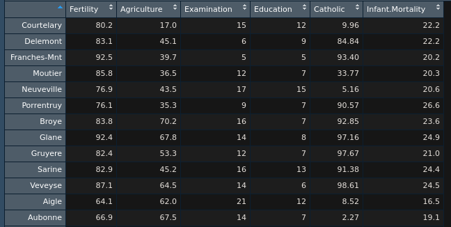

```{r setup, include=FALSE, purl=FALSE}
library(knitr)

options(htmltools.dir.version = FALSE)
knitr::opts_chunk$set(comment = "##")
```

# Objects

To create an object, you can use:
--

- `<-` `<<-` assignment (right to left)
--

- `->` `->>` rightwards assignment
--

- `=` assignment (right to left)
--


99.9% of the time you will use `<-`:
```{r, eval=FALSE}
object <- value
```
--

You should *never* use `=` for object assignment. The reason is that `=` calls two different functions depending on the context:

.pull-left[
```{r}
mean(x = c(1, 2, 3, 4, 5))
```
]

.pull-right[
```{r, error=TRUE}
print(x)
```
]
---
.pull-left[
```{r}
mean(y <- c(1, 2, 3, 4, 5))
```
]

.pull-right[
```{r, error=TRUE}
print(y)
```
]
--


You can fix this by telling R that your `=` is meant to be an assignment operator, not argument assignment:
<div>
.pull-left[
```{r}
mean((z = c(1, 2, 3, 4, 5)))
```
]

.pull-right[
```{r}
print(z)
```
]
</div>

******
--

You can also assign object left-to-right using `->`, but <u>this is very unusual</u> and only done in unique circumstances where doing so improves readability of our code:
```{r, eval=FALSE}
value -> object
```
--


We'll get back to `<<-` and `->>` later in the course when we learn how to create our own functions. For now you can forget about them!
---
# Comments
 
Comments are a very important part of writing R code! When R sees a comment, it will skip over trying to interpret (i.e., run) that code.

Use the `#` to write a comment in your R script:
```{r}
# This code is a comment, so R doesn't run it as code
```

```{r, error=TRUE}
This code is not a comment, so R tries to run it as code
```

Commenting your code helps you:
- Remember what a chunk of code does when you return to the code
- Communicate with collaborators
- Keep your code organized
---
# Atomic Types

R, like other programming languages, keeps track of the type of object you are working with. It does this much in the same way that we do in our own lives. For example, we know that our age is a number and our name is a bunch of characters squished together.
--


There are *four* main atomic types in R (there are more, but you most likely won't use them)
--


To check the type of a value in R, you can use the `typeof()` function. For example:
```{r}
typeof("Psych548")
typeof(TRUE)
```
---
# 1. Numeric

Numeric vectors (more on these later) are numbers, either *integers* or *doubles* (i.e., floating point numbers, decimals)
- Integers: 1, 2, 3, 4, etc.
- Doubles: 1.0, 2.43, 3.92, 4.0934853409
--


To check directly if something is numeric, an integer, or a double:
- `is.numeric(x)`
- `is.integer(x)`
- `is.double(x)`
--


You can also coerce (i.e., tell R) that you want to store a value as a numeric object:
- `as.numeric(x)`
- `as.integer(x)`
- `as.double(x)`

---

**Note**: Unless you say otherwise, R will store all numeric values as doubles:

```{r}
typeof(10)
```

You can specify a single integer using a whole number following by `L`:

.pull-left[
```{r}
is.integer(10)
```
]

.pull-right[
```{r}
is.integer(10L)
```
]
--


All integers and doubles are numeric:
```{r}
is.numeric(30)
is.numeric(30L)
```

---
# 2. Character

Character vectors contain **strings** of characters squished together using quotations. For example:

```{r}
"This is a string"
"هذه سلسلة "
"นี่คือสตริง"
```
--


This is also, technically, a string (character type):
```{r, eval=FALSE}
""
```
---
To check directly if something is of type character:
- `is.character(x)`

You can also coerce values into characters using:
- `as.character(x)`

For example:
```{r}
as.character(1234)
```

******
--


To check how many characters are in a string, you can use the `nchar()` function:
```{r}
nchar("Psych548")
```
---
To squish two strings together, use the `paste()` function:
```{r}
paste("Adam", "Kuczynski")
```
--

To insert formatted values into strings, use `sprintf()`<sup>1</sup>:
```{r}
weeknum <- 2
weekchar <- "two"
sprintf("This is Week %d (%s) of the quarter.", weeknum, weekchar)
```
.footnote[[1] see `?sprintf` for more information. This is a really powerful function that lets you do things like format values dynamically.]
--


`glue()` will make your life a lot easier!
```{r}
library(glue)
glue("This is Week {weeknum} ({weekchar}) of the quarter.")
```


---
# 3. Logical

Logical values are `TRUE`, `FALSE`, and `NA` (more on this later).
--


Logical types *must* be capitalized. `True` is not the same as `TRUE`.
--


Logical types are also commonly represented as one uppercase letter:
- `TRUE`, `T`
- `FALSE`, `F`
--


To check directly if something is logical type:
- `is.logical(x)`

You can also coerce values into logical types:
- `as.logical(x)`

```{r}
is.logical(TRUE)
```
---
Underneath the hood, R stores logical values as 0s (`FALSE`) and 1s (`TRUE`). This means
you can do math with logical values!
```{r}
as.numeric(c(TRUE, FALSE))
```
--

```{r}
TRUE + TRUE
```
--

```{r}
FALSE + FALSE + TRUE
```
--

```{r}
50 / TRUE
```
--

```{r}
TRUE*3 / 2 + 50^F
```
---
# 4. Factor

Factors are a special type of variable that is used to denote categorical values. These are *extremely* useful when analyzing categorical data, because R will do all the dummy coding for you.
--


Underneath the hood, factors are stored as numeric values with a table of corresponding levels. This means that factors take up less memory than characters, and comparing factors will be faster than comparing strings (because R only needs to compare numbers).<sup>1</sup>

.footnote[[1] This likely will not make a difference for you though! The most important consideration in determining whether or not an object should be a factor is whether it is categorical.]
--


To check directly if something is a factor:
- `is.factor(x)`

To coerce something into a factor:
- `as.factor(x)`


---
.smallish[
Coercing a character vector into a factor is easy because R already knows the labels for each level:
```{r}
areas <- c("Clinical", "Social", "Cog/Per", "Developmental", "BNS", "Animal Behavior")
areas <- as.factor(areas)
print(areas)
```
--

However, often you will have a numeric vector that represents categorical data. To change numeric vectors into factors:
```{r}
agegroup <- c(0, 1, 0, 2, 1, 0)
agegroup <- factor(x = agegroup,
                   levels = c(0, 1, 2),
                   labels = c("Child", "Adolescent", "Adult"))
print(agegroup)
```
]
---
class: inverse
# Logical and Relational Operators
---
# What are operators?

Logical operators are foundational to programming in R and allow you to compare two values together to control your programming logic.
--


Logical operators *always* return a logical value (`TRUE`, `FALSE`, or `NA`), and are most commonly
used to subset data (more on this later) and control the flow if your code `if`/`else` statements
(more on this later as well!)
--


.pull-left[
Relational Operators:
- `<`, `>`,
- `>=`, `<=`,
- `==`, `!=`
]
--


.pull-right[
Logical operators:
- `&`, `&&`
- `|`, `||`
- `!`
]
---
# Relational Operators
`>` and `<` return `TRUE` if the left side is greater than (`>`) or less than (`<`) the right side, otherwise they return `FALSE`

```{r}
200 > 300
300 > 200
200 < 300
300 < 200
```
---
`>=` and `<=` return `TRUE` if the left side is greater than or equal to (`>=`) or less than or equal to (`<=`) the right side, otherwise they return `FALSE`
```{r}
300 > 200
300 >= 300
300 <= 200 
200 <= 300
```
---
`==` and `!=` return `TRUE` if the left side is equal to (`==`) or not equal to (`!=`) the right side, otherwise they return `FALSE`
```{r}
200 == 200
200 == 300
200 != 200
200 != 300
```
---
# Comparing strings

You can also use relational operators to compare strings:
```{r}
"This" == "This"
```
--

```{r}
"This" == "That"
```
--

```{r}
"This" != "That"
```
--


Be careful though! These comparisons are case sensitive:
```{r}
"this" == "THIS"
```
---
Things get weird though when you use other relational operators with strings

.pull-left[
Shouldn't this throw an error?
```{r}
"UW" > "WSU" 
```

R *can* compare strings in this way, but this doesn't mean you should!
]

.pull-right[

]

What does this even mean?!
```{r}
"A" > 10
11 > "10"
```
---
# and, and and

.pull-left[
The `&` and `&&` ('and', 'and and') operators are used to compare whether two (or more) conditions are `TRUE`

If both conditions are `TRUE`, `TRUE` is returned, otherwise `FALSE` (or `NA`<sup>1</sup>) is returned

.footnote[[1] Caution: If one of the terms is `NA`, `&&` will return `NA`.]
]

<div class="pull-right" style="text-align:center;">
  
</div>
--


```{r}
TRUE && TRUE
TRUE && FALSE
```


---
You can combine multiple `&&` to check that *all* conditions evaluate to `TRUE`
```{r}
TRUE && TRUE && T && TRUE
TRUE && FALSE && TRUE && FALSE
```
--


`&&` is more helpful when we can actually evaluate certain conditions
```{r}
1 == 2 && 100 == as.numeric("100")
50 < 51 && as.logical(1) & is.data.frame(mtcars)
```
---
## Single `&` versus double `&&`
--


The single `&` performs comparisons on *all* values.
--


The double `&&` performs comparisons only until it knows what the outcome will be.
--


For example, even though the operation below *has* to return `FALSE` (since the first half is `FALSE`), it
evaluates the second half anyways (which throws an error)
```{r, error=TRUE}
exists("nonexistent_object") & nonexistent_object == 1
```
--


Using `&&` will properly return FALSE (because it doesn't evaluate the second half).
```{r}
exists("nonexistent_object") && nonexistent_object == 1
```
---
When given a vector, `&` performs comparisons on all elements:
```{r}
c(TRUE, FALSE, TRUE) & c(TRUE, TRUE, TRUE)
```
--

`&&` performs comparisons *only* on the first element:
```{r}
c(TRUE, FALSE, TRUE) && c(TRUE, TRUE, TRUE)
c(FALSE, FALSE, TRUE) && c(TRUE, TRUE, TRUE)
```
--


<u>Bottom line:</u> When using operators to produce one `TRUE`/`FALSE` value, you most likely want to use `&&`
---
# or, or or

The `|` and `||` ('or', 'or or') operators are used to compare whether one of two (or more) conditions are `TRUE`
--


If one or more conditions  `TRUE`, `TRUE` is returned, otherwise `FALSE` (or `NA`) is returned.
--


```{r}
TRUE || FALSE
```
--

```{r}
FALSE || TRUE
```
--

```{r}
FALSE || FALSE
```
---
Similar to the single `&` and double `&&`, `|` evaluates all conditions while `||` stops when the first `TRUE` is reached
--


So this throws an error:
```{r, error=TRUE}
TRUE | nonexistent_object == 1
```
--


But this does not:
```{r}
TRUE || nonexistent_object == 1
```
--


You can combine multiple `||` or evaluate several conditions. For example:
```{r}
FALSE || 1 == 2 || "This" == "That" || TRUE
```
---
When given a vector, `|` performs comparisons on all elements:
```{r}
c(TRUE, FALSE, TRUE) | c(TRUE, TRUE, TRUE)
```
--


`||` performs comparisons *only* on the first element:
```{r}
c(FALSE, FALSE, TRUE) || c(FALSE, TRUE, TRUE)
```
---
# not!

.smallish[
.pull-left[
Also known as the "bang" operator

Converts `TRUE` into `FALSE` and `FALSE` into `TRUE`
]

.pull-right[

]
--

```{r}
!TRUE
!FALSE
# Don't actually do this!
!!!!!!!!!FALSE
```

]

---

The `!` operator is used when you want to check if a condition does *not* evaluate to `TRUE`. For example to make sure something is not numeric:
```{r}
!is.numeric("ABCD")
```
--


You can negate anything that returns a logical value

```{r}
!(1 == 1 && 2 == 2)
```
--

```{r}
# Function that just returns TRUE when it is called
returnTRUE <- function() return(TRUE)
returnTRUE()
```
--

```{r}
!returnTRUE()
```
---
# Type coercion

If a relational or logical operator is passed (i.e., used with) two different atomic vectors as arguments, R will automatically coerce (i.e., change) one type to the other.
--


Coercion occurs in the following (decreasing) order of precedence:
1. Character
2. Complex
3. Numeric
4. Integer
5. Logical
6. Raw

For example, R will coerce this entire vector (which can only be one atomic type) to character because there is a character inside:
```{r}
c("Psych548", 548.00, 548, TRUE)
```
---
But if we remove the character, it coerces it to numeric:
```{r}
c(548.00, 548, TRUE)
```
--


This is why operations we looked at previously technically work:
```{r}
"A" > 10
```

`10` is coerced to `"10"` and then `"A"` is compared to it. Letters come before numbers in R's character comparison.

```{r}
11 > "10"
```
`11` is coerced to `"11"` and the string `"11"` is larger than the string `"10"`
---
# Missing Values

Missing values in R are represented as `NA` (without quotes)
```{r, include=FALSE}
vector_with_NAs <- c(1, 2, NA, 4, 5, NA, 7)
```
--


Even one `NA` "poisons the well. Your calculations will return `NA` unless you handle missing values properly:
```{r}
mean(vector_with_NAs)
```
--

```{r}
mean(vector_with_NAs,
     na.rm = TRUE) #<<
```

The `na.rm` argument in `mean()` removes missing values prior to calculating the mean.

---
`NA` is technically a logical variable...
```{r}
typeof(NA)
```
--


But it *can* be other types as well (we have missing data for characters and numeric variables too!):
```{r}
as.numeric(NA)
```
--


You can directly tell R which type of `NA` you want to use:
- `NA_real_` (double)
- `NA_integer_` (integer)
- `NA_character_` (character)

```{r}
c(NA_character_, 100)
```
---
# Detecting Missing Values

**WARNING:** You can't test for missing values by seeing if they are equal to NA (`==NA`):
```{r}
vector_with_NAs == NA
```
--


Instead, you need to use the `is.na()` function:
```{r}
is.na(vector_with_NAs)
```
--


And to check that a value is *not* `NA`:
```{r}
!is.na("This is not NA")
```
---
# `Inf` and `NaN`
R also has representations for positive and negative infinity (`Inf`, `-Inf`) and undefined values (`NaN`; **N**ot **a** **N**umber):
```{r}
c(-1, 0, 1) / 0
```
--


.pull-left[
To check if something is finite or not, use `is.finite()`:
```{r}
is.finite(c(-1, 0, 1) / 0)
```
]
--


.pull-right[
To check if something is not defined, use `is.nan()`:
```{r}
is.nan(c(-1, 0, 1) / 0)
```
]
---
class: inverse
# Vectors

---
# Making Vectors

In R, a **vector** is a set of values that are the <u>same atomic type</u>
--


We create vectors using the `c()` function (for '**c**ombine' or '**c**oncatenate'):
```{r}
c(3, 500, -Inf, -1.23, 24/2*10)
```
--


You can also use `:` as shorthand to create vectors of series of numbers (incremented by one):
```{r}
1:10
-5:5
```
---
The following also works but is more unusual to see:
```{r}
1.5:10.5
```

******
--


You can also create numeric vectors using the `seq()` (for **seq**uence) function:
```{r}
seq(from = 1, to = 11, by = 2)
```
--

```{r}
seq(from = 1, to = 10, length.out = 5)
```
---
.pull-left[
`seq_len` will return the same result as `1:length`:
```{r}
seq_len(4)
```
]
--


.pull-right[
`seq_along` will return a vector of 1:N elements of another vector:
```{r}
seq_along(5:10)
```
]

******
--


You can create vectors of repeated values with `rep()`:
```{r}
rep(10, times = 5) # Repeat 10 five times
```
--

```{r}
rep(c(TRUE, FALSE), times = 3) # Repeat c(TRUE, FALSE) 3 times
```
--

```{r}
rep(c("One", "Two"), each = 3) # Repeat each element 3 times
```

---
Vectors are one-dimensional (**length**) by definition:
```{r}
length(c(90, -0.5, 2, Inf))
```
--


Nested calls to `c()` are flattened:
```{r}
length(c(1, c(2, 3, 4, c(5, 6, 7, 8))))
```

******
--


If all elements of a vector are not the same type, R will coerce the vector into one type<sup>1</sup>:
```{r}
c("One", 1, TRUE)
```
.footnote[[1] This is the source of many bugs, so be careful with this!]
---
# Vector Math

When doing arithmetic operations with vectors, R handles these *elementwise*:
```{r}
# 1*4, 2*5, 3*6 #<<
c(1, 2, 3) * c(4, 5, 6)

# 1^4, 2^4, 3^4, 4^4 #<<
c(1, 2, 3, 4)^4
```

Other common operations on numeric vectors:

`+`, `-`, `/`, `exp()`= $e^x$, `log()` = $\log_e(x)$

---
# Vector Recyling

If you do math of vectors with different lengths, R will **recycle** the shorter one by repeating it until it matches the length of the longer one. For example:
```{r}
# 1*1, 2*2, 1*3, 2*4 #<<
c(1, 2) * c(1, 2, 3, 4)

# Same exact operation as above
c(1, 2, 1, 2) * c(1, 2, 3, 4)
```
--


You can recycle with a **scalar** (a single number) as well:
```{r}
# 1+1, 1+2, 1+3
1 + c(1, 2, 3)
```
---
# Warning on Recycling

R will warn you if you do math with vectors of incommensurate lengths (but it will not throw an error!):
```{r}
# 1+1, 2+2, 3+3, 1+4
c(1, 2, 3) + c(1, 2, 3, 4)
```
---
# Vectorwise Math
Some functions operate on the entire vector and return one number (rather than operating elementwise):
```{r}
sum(1:5)
max(c(1, 4, 10:999))
```

Other vectorwise summary functions include:

`min()`, `mean()`, `median()`, `sd()`, `var()`
---
# Example: Standardizing Data

You can combine elementwise and vectorwise math to perform your calculations. For example, if you want to standardize a vector of values (e.g., scores on a beahvioral tasks):

$$z_i = \frac{x_i - \text{mean}(x)}{\text{SD}(x)}$$
```{r}
scores <- c(30, 28, 47, 27, 97, 49, 84, 78, 33, 48)
z <- (scores - mean(scores)) / sd(scores)
round(z, 2)
```
--


You can also use the built-in `scale()` function to do this for you:
```{r}
identical(z, as.vector(scale(scores)))
```
---
# Logical Vectors are Special!

A logical vector is a vector filled with `TRUE` and `FALSE` values
--


Typically logical vectors are created programmatically as a result of logical tests (e.g., `course == "Psych548"`). For example, if you want to check whether a group of people are old enough to purchase alcohol:
```{r}
ages <- c(13, 43, 72, 24, 21, 20, 40, 15, 29)
ages >= 21
```
--


Logical vectors are most useful when you want to take a subset of a vector (or other data type). Only ages 21+ are selected:
```{r}
ages[ages >= 21]
```
---
# Subsetting Vectors

There are many ways to **subset** a vector. You will primarily use `[` and `]` to specify a subset of a vector, however you can also use the `subset()` function.

```{r}
# Adult clinical core faculty
faculty <- c("Corey", "Angela", "Bill", "Mary", "Jane", "Lori")
```
--


.pull-left[
You can pass a single index (scalar) or vector of values to **keep**:
```{r}
faculty[c(4, 5)]
```
]
--


.pull-right[
You can pass a single index or vector or values to **drop**:
```{r}
faculty[-c(1, 3:5)]
```
]
--


You can also pass a logical vector(`TRUE` to keep, `FALSE` to drop):
```{r}
faculty[c(T, F, T, F, F, T)]
```
---
Using logical vectors to subset other vectors is incredibly useful

For example, what if the order of the names changed, but you wanted to keep Mary and Jane?
```{r}
faculty == "Mary" | faculty == "Jane"
```
--


```{r}
faculty[faculty == "Mary" | faculty == "Jane"]
```
--


Or maybe you want to know which faculty have at least 1 grad student<sup>1</sup>:
```{r}
# How many grad students does each faculty have?
gradstudents <- c(1, 0, 4, 3, 2, 3)
faculty[gradstudents > 1]
```
---
The `subset()` function can also be used to subset vectors:
```{r}
subset(faculty, gradstudents > 1)
```
--


When subsetting vectors, the only difference between `[]` and `subset()` is that `subset()` removes `NA`s

```{r}
myvector <- 1:5
myvector[c(T, T, F, NA, T)]
```
--

```{r}
subset(myvector, c(T, T, F, NA, T))
```
--

```{r}
myvector[c(T, T, F, NA, T) & !is.na(c(T, T, F, NA, T))]
```
---
# Named vectors

You can assign **names** to the elements of a vector using the `names()` function:
```{r}
names(gradstudents) <- faculty
print(gradstudents)
```

☝️ The elements of this vector are still numeric!
--


Names are a useful way of subsetting your data and do not depend on the order of the vector:
```{r}
gradstudents[c("Mary", "Jane")]
```
---
### Helpful Logical/Subsetting Functions

`%in%` allows you to avoid typing a lot of OR (`|`) statements out:
```{r}
# Same as: faculty == "Mary" | faculty == "Jane"
faculty %in% c("Mary", "Jane")
!faculty %in% c("Mary", "Jane") # Faculty not Mary and Jane
```
--


`which()` gives you the indices (locations) of `TRUE` values in a logical vector:
```{r}
which(faculty %in% c("Mary", "Jane"))
```
---
class: inverse
# Matrices
---
# Making Matrices

**Matrices** are basically two dimensional vectors with **rows** and **columns** and are made with the `matrix()` function

```{r}
# LETTERS is a built-in vector in R w/ elements A-Z
matrix(LETTERS[1:6], nrow = 2, ncol = 3)
```
--


The `byrow` argument (defaults to `FALSE`) determines whether the data fills the matrix by row (`TRUE`) or by column (`FALSE`):
```{r}
matrix(LETTERS[1:6], nrow = 2, ncol = 3, byrow = T)
```
---
You can also make matrices by binding vectors together with `rbind()` (**r**ow **bind**) and `cbind()` (**c**olumn ** bind**):
--


.pull-left[
```{r}
rbind(1:3, 4:6, 7:9)
```
]
--


.pull-right[
```{r}
cbind(1:3, 4:6, 7:9)
```
]

******
--


Let's make a matrix to practice subsetting on the next slide!

```{r}
letters_matrix <- matrix(letters[1:6], nrow = 2,
                         ncol = 3, byrow = T)
print(letters_matrix)
```

---
# Subsetting Matrices

Matrices are subset wtih `[rows, colums]`
--


.pull-left[
```{r}
# Row 2, Column 3
letters_matrix[2, 3]
```
]
--


.pull-right[
```{r}
# Row 1, Columns 2 and 3
letters_matrix[1, c(2, 3)]
```
]
--


If you want to keep the entire row or column, keep the space inside the square braces (`[]`) blank:
--


<!-- div needed for proper alignment within -->
<div>
.pull-left[
```{r}
# All rows, column 1
letters_matrix[, 1]
```
]
--


.pull-right[
```{r}
# Row 2, all columns
letters_matrix[2, ]
```
]
</div>
---
# Matrices -> Vectors

When a matrix is subsetted to just 1 row/column of data (like we saw in the previous slide), R will automatically convert it to a vector. You tell R *not* to do this by using `drop = FALSE`:

.pull-left[
```{r}
# All rows, column 1
letters_matrix[2, ]
```
]

.pull-right[
```{r}
# Row 2, all columns
letters_matrix[2, , drop = F]
```
]

******
--


To get the dimensions of a matrix, use `dim()`

```{r}
# Returns vector of length 2: c(rows, columns) #<<
dim(letters_matrix)
```
---
# Matrix Atomic Type Warning

Like vectors, <u>all elements of a matrix must be the same atomic type</u>. If they are not, R will automatically coerce the matrix according to the rules discussed earlier (character > complex > numeric > integer > logical > raw)
```{r}
cbind(1:2, c("UW", "WSU"))
```
---
# Named Matrices

You can assign **names** to rows (`rownames()`) and columns (`colnames()`) of a matrix:
```{r}
mymatrix <- matrix(1:6, nrow = 2)
rownames(mymatrix) <- c("Odds", "Evens")
colnames(mymatrix) <- c("First", "Second", "Third")
print(mymatrix)
```
--


You can then subset the matrix by the dimension names:
```{r}
mymatrix["Evens", c("First", "Third"), drop = F]
```
---
# Matrix Math

If two matrices have the same dimensions, math can be formed elementwise. For example:

.pull-left[
```{r}
mat1 <- matrix(1:6, ncol = 3)
print(mat1)
```
]

.pull-right[
```{r}
mat2 <- matrix(1:6, ncol = 3, byrow = TRUE)
print(mat2)
```
]
--


<div>
.pull-left[
```{r}
mat1 / mat2
```
]
--


.pull-right[
```{r}
mat1 * mat2
```
]
</div>
---
## Matrix Transposition and Multiplication

To transpose a matrix, use `t()`:


```{r}
mat1t <- t(mat1)
print(mat1t)
```
--


To do actual matrix multiplication (not elementwise), use `%*%`:
```{r}
mat1 %*% mat1t
```
---
# Matrix Inversion

To invert an invertible square matrix, use `solve()`:
```{r}
mat4 <- mat1 %*% mat1t
mat4i <- solve(mat4)
print(mat4i)
mat4 %*% mat4i
```

Note the [floating point imprecision](https://floating-point-gui.de/basic/): The off-diagonals are *very close to zero* rather than actually zero!

---
# Diagonal Matrices

To extract the diagonal of a matrix or make a diagonal matrix (usually the identity matrix), use `diag()`:

```{r}
varcov_mtcars <- cov(mtcars[, 1:3])
print(varcov_mtcars)
```
--


Get the variances of the first 3 variables in `mtcars`:
```{r}
diag(varcov_mtcars)
```
---
You can also use `diag()` to make an identity matrix of size *n*:
```{r}
diag(2)
diag(3)
diag(4)
```
---
class: inverse
# Lists

---
**Lists** are objects that can store multiple types of data and are created with `list()`

.small[
```{r}
mylist <- list("groceries" = c("Soy Sauce", "Rice", "Tofu"),
               "numbers" = 1:7,
               "mydata" = matrix(8:11, nrow = 2),
               "linearmod" = lm(mpg ~ disp, data = mtcars))
print(mylist)
```
]

---
# Accessing List Elements

You can access a list element by its name or number in `[[` `]]` (note the double square brackets) or `$` followed by its name:
```{r}
mylist[[1]]
```
--

```{r}
mylist[["groceries"]]
```
--

```{r}
mylist$groceries
```
---
# Why two brackets `[[` `]]`?

Single brackets return a **list**

Double brackets return the actual list element as whatever data type it is stored as:

```{r}
typeof(mylist[1])
typeof(mylist[[1]])
```

---
# `[]` versus `[[]]`


`[x]` chooses elements but keeps the list while `[[x]]` extracts the element from the list

.footnote[Source: [Hadley Wickham](https://twitter.com/hadleywickham/status/643381054758363136?lang=en)]
---
# Regression Output is a List!
.small[
```{r}
# Display only the first 7 elements
str(mylist$linearmod, list.len = 7)
```
]
---
# Named Lists

Lists can be unnamed:
```{r}
unnamed_list <- list(c("Apples", "Bananas", "Oranges"),
                     1:10,
                     diag(3))
print(unnamed_list)
```
---
You can use `names()` to access the names of a named list and to assign names to an unnamed list:
```{r}
names(mylist)
names(unnamed_list) <- c("Fruit", "Numbers", "Identity Matrix")
print(unnamed_list)
```
---
class: inverse
# Dataframes
---
**Dataframes** are a special type of list where all elements of the list are the same length and are bound together
--


Unlike matrices, dataframes can hold data of different atomic types (but each column needs to be the same type)

******
--


To construct a dataframe from scratch, use the `data.frame()` function:
```{r}
uwclinpsych <- data.frame("name" = c("Corey", "Angela", "Bill", "Mary", "Jane", "Lori"),
                          "grads" = c(1, 0, 4, 3, 2, 3),
                          "fullprof" = c(F, F, T, T, T, T))
print(uwclinpsych)
```
---
You can also create dataframes using `rbind()` and `cbind()`, but unless you are binding two dataframes together, it will return a matrix:
--


.smallish[
```{r}
cbind("name" = c("Corey", "Angela", "Bill", "Mary", "Jane", "Lori"),
      "grads" = c(1, 0, 4, 3, 2, 3),
      "fullprof" = c(F, F, T, T, T, T))
```
--

```{r}
rbind(uwclinpsych[4:6, ], uwclinpsych[1:3, ])
```
]
---
# Subsetting Dataframes

Dataframes are subset in the same way as matrices(`[rows, columns]`)
```{r}
uwclinpsych[, 1]
```
--

```{r}
uwclinpsych[, "name"]
```
--

```{r}
uwclinpsych[c(1, 3, 5), ]
```
---
You can also use the `$` operator to target a single column
```{r}
uwclinpsych$name
```

******
--


When you have data that are related to each other and it is possible to store them as a dataframe, you should! This allows you to confidently make subsets for your analyses:
```{r}
uwclinpsych[uwclinpsych$grads > 2, "name"]

```
--


👇 same return value
```{r}
uwclinpsych$name[uwclinpsych$grads > 2]
```
---
```{r, eval=F}
uwclinpsych$name[uwclinpsych$grads > 2 &
                   uwclinpsych$fullprof]
```

☝️ What is this code doing?
--

```{r, echo=F}
uwclinpsych$name[uwclinpsych$grads > 2 &
                   uwclinpsych$fullprof]
```


******
--

If you want to subset one column of a dataframe while keeping it as a dataframe object, use `drop=FALSE`:

.smallish[
```{r}
uwclinpsych[, 1]
uwclinpsych[, 1, drop = FALSE]
```
]
---
# Viewing Dataframes

You can view an entire dataframe by `print()`ing it out in the console.<sup>1</sup> However, it often just spams your console and is too large to meaningfully read.

.footnote[[1] You can also type the name of the dataframe without `print()` and R will print it!]
--


.pull-left[
To view the <u>first</u> *n* rows of a dataframe use `head()` (defaults to 5 rows):
```{r}
head(uwclinpsych, 3)
```
]
--


.pull-right[
To view the <u>last</u> *n* rows of a dataframe use `tail()` (defaults to 5 rows):
```{r}
tail(uwclinpsych, 4)
```
]


---
You can also `View()` a more friendly pop-up of your data and, in RStudio, filter and sort as you view

```{r, eval=FALSE}
View(swiss)
```

<div style="text-align:center;">
  
</div>
---
# Attributes

Objects in R can have **attributes**, which are basically metadata that describe an object. To get an object's attributes, use the `attributes()` function.
--


This can help give you an overview of an object's properties. For example:
```{r}
# Linear regression w/ one predictor
linearmod <- lm(mpg ~ disp, data = mtcars)
attributes(linearmod)
```
---
Attributes also offer a nice way to document a dataframe

Consider the following data:
```{r, echo=FALSE}
dat <- data.frame(pid = c("1001", "1002", "1003", "1004"),
                  txm = c(1, 2, 3, 1),
                  phq = c(10, 17, 3, 25),
                  pcl = c(3, 28, 43, 17))
```

.pull-left[
```{r}
print(dat)
```
]

.pull-right[
<div style="min-height:45px;"> </div>
🤔 what is `pid`?

🤔 what is `txm`?

🤔 what is `phq`?

🤔 what is `pcl`?
]
--


We can assign attributes to each column to document what each is:
```{r}
attr(dat$pid, "Label") <- "Participant ID"
attr(dat$txm, "Label") <- "Treatment Modality"
attr(dat$phq, "Label") <- "Depression (measured by PHQ-9)"
attr(dat$pcl, "Label") <- "PTSD Sx (measured by PCL-5)"

# Columns can have as many attributes as you would like!
attr(dat$txm, "Values") <- c("1" = "CPT", "2" = "PE", "3" = "TAU")
```
---

You and your collaborators can then reference these attributes
```{r}
attributes(dat)
attributes(dat$txm)
```

