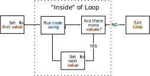
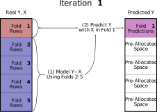
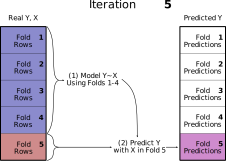
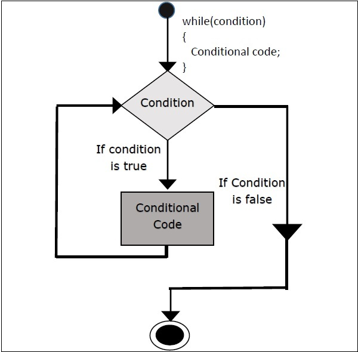

```{r setup, include=FALSE, purl=FALSE}
library(knitr)
library(plotly)
library(tibble)
library(ggplot2)

options(htmltools.dir.version = FALSE)
knitr::opts_chunk$set(comment = "##")
```

**Control structures** allow you to control the flow of your R program (script) and are critical to programming in R
--


There are three components of a program's flow: 
--


1. **Sequential**: the order in which the R code is executed
> "do *this* first, then *that*"
--


2. **Selection**: which path of an algorithm R will execute based on certain criteria
> "do *that*, but only if *this* is `TRUE`

  - `if`/`else`
  - `switch`
--


3. **Iteration**: how many types should a certain algorithm be repeated?
> "do *this* 100 times, then move on to *that*"

  - `for`, `while`, `repeat`
  - `break`, `next`
  
---
# `if()` otherwise `else`

`if()` and `else` statements allow you to conditionally execute code
--


For example, write a program that tells a cashier whether or not they should sell alcohol to a customer. The cashier enters the customer's birthday into their POS, which needs to display the appropriate message:
```{r, eval=FALSE}
# Calculate age
age <- as.numeric(difftime(Sys.time(), as.Date(birthday))) / 365

if(age >= 21){
  print(paste("Age:", floor(age), "(Sell)"))
} else {
  print(paste("Age:", floor(age), "(Do not sell)"))
}
```


```{r, echo=FALSE}
selldrink <- function(birthday){
  age <- as.numeric(difftime(Sys.time(), as.Date(birthday))) / 365
if(age >= 21){
  print(paste("Age:", floor(age), "(Sell)"))
} else {
  print(paste("Age:", floor(age), "(Do not sell)"))
}
}
```
--


.pull-left[
```{r}
birthday <- "2002-05-20"
```

```{r, echo=FALSE}
selldrink(birthday)
```
]
--


.pull-right[
```{r}
birthday <- "1970-12-15"
```

```{r, echo=FALSE}
selldrink(birthday)
```
]
---
`if()` statements do not need an else statement, if there is no alternative
```{r}
number <- 31

# If number is even
if(number %% 2 == 0){
  print("Congratulations! It's an even number.")
}
```
--

You can also have multiple `if/else` statements in a row, if there are more than two outcomes
```{r}
number <- 27

if(number %% 2 == 0){
  print("Congratulations! It's an even number!")
} else if(number %% 3 == 0){
  print("Your number is divisible by 3")
} else {
  print("Your number is not even or divisible by 3")
}
```
---
The statements evaluated by `if()` *always* need to return a single `TRUE` or `FALSE` value
.smallish[
```{r}
if(TRUE){
  print("This will always run")
} else {
  print("This will **never** run")
}
```

```{r, error=T}
if("Character"){
  print("Take the course")
}
```
]
--


Be careful, though! R will coerce values inside `if()` in unexpected ways:

.smallish[
.pull-left[
```{r}
if(359){
  print("This code ran")
}
```
]

.pull-right[
```{r}
if("TRUE"){
  print("This code ran")
}
```
]
]
---
You can have multiple conditions inside an `if()` statement as well with `else if()`

```{r}
age <- 36
hasmoney <- TRUE

if(age > 21 && hasmoney){
  print("Sell!")
} else if(age > 21 && !hasmoney){ # of age, but no money #<<
  print("Sell when they have money!")
} else {
  print("Do not sell")
}
```
--

.smallish[
.pull-left[
```{r}
age <- 36
hasmoney <- FALSE
```

```{r, echo=FALSE}
selletoh <- function(age, hasmoney){
  if(age > 21 && hasmoney){
    print("Sell!")
  } else if(age > 21 && !hasmoney){ # of age, but no money
    print("Sell when they have money!")
  } else {
    print("Do not sell")
  }
}

selletoh(36, FALSE)
```
]

.pull-right[
```{r}
age <- 12
hasmoney <- TRUE
```

```{r, echo=FALSE}
selletoh(12, TRUE)
```
]
]
---
# `ifelse()` and `if_else()`

`if/else` takes *one* `TRUE` or `FALSE` value, but sometimes we want to evaluate multiple values at once
--


`ifelse()` is a **vectorized** version of `if/else` that can operator over vectors:
```{r}
ages <- c(35, 12, 82, 21, 15)
ifelse(ages > 21, "Sell alcohol", "Do not sell alcohol")
```
--


.pull-left[
`ifelse()` if very useful inside a dataframe to transform your data.

Remember the `uwclinspsych` dataframe from last week? 👉
]
```{r, echo=FALSE}
uwclinpsych <- data.frame("name" = c("Corey", "Angela", "Bill", "Mary", "Jane", "Lori"),
                          "grads" = c(1, 0, 4, 3, 2, 3),
                          "fullprof" = c(F, F, T, T, T, T))
```

.pull-right[
```{r, echo=FALSE}
# Remember the uwclinpsych dataframe from last week?
print(uwclinpsych)
```
]
---
Lets create a new variable inside `uwclinpsych` called `newgrad` that is the number of grad students each faculty is allowed to take this year

If a faculty has 3+ grad students they aren't allowed to take any, but if they have 0-2 they are allowed to take up to 2:
--


```{r}
uwclinpsych$newgrad <- ifelse(test = uwclinpsych$grads >= 3,
                              yes = 0,
                              no = 2)
print(uwclinpsych)
```
---
`if_else()` from the `dplyr` package<sup>1</sup> is *very* similar to base R's `ifelse()` except it makes sure the return values are the same type:
```{r}
mylets <- factor(sample(letters[1:5], 10, replace = TRUE))
print(mylets)
ifelse(mylets %in% c("a", "b", "c"), mylets, factor(NA))
dplyr::if_else(mylets %in% c("a", "b", "c"), mylets, factor(NA))
```

.footnote[[1] The `dplyr` package is written by [Hadley Wickham](http://hadley.nz/) and is part of the [Tidyverse](https://www.tidyverse.org/).]
---
# `switch()`

`switch()` operates in much the same way as `if/else` statements by letting you select among a list of alternatives given one input value
--


`switch()` is useful when you have:
- one single test condition
--

- your test condition is character or an integer representing an index within a list of option
--

- you have 2+ conditions

******
--


From `help(switch)`:

```{r, eval=FALSE}
switch(EXPR, ...)
```

- `EXPR` = an expression evaluating to a number or a character string
- ... the list of alternatives. If it is intended that EXPR has a character-string value these will be named, perhaps except for one alternative to be used as a ‘default’ value.
---
If `EXPR` is **numeric**, R will return the list of alternatives corresponding with that index:

.pull-left[
```{r}
switch(1,
       "First",
       "Second",
       "Third")
```
]

.pull-right[
```{r}
switch(3,
       "First",
       "Second",
       "Third")
```
]
--


If `EXPR` is **character**, R will search the list of alternatives and return the associated value:

<div>
.pull-left[
```{r}
switch("this",
       this = "This one!",
       that = "That one!",
       "The other one!")
```
]

.pull-right[
```{r}
switch("Not this or that!",
       this = "This one!",
       that = "That one!",
       "The other one!")
```
]
</div>

<div style="text-align:center;">
☝️ Notice the unnamed argument at the end! This is optional. ☝️
</div>

---
Using `switch()` prevents you from having to write a bunch of `if/else` statements (it can also result in faster code, but this is generally negligible):

```{r, eval=FALSE}
switch("this",
       this = "This one!",
       that = "That one!",
       "The other one!")
```

☝️ is equivalent to 👇

```{r, eval=FALSE}
if(x == "this"){
  "This one!"
} else if(x == "that"){
  "That one!"
} else {
  "The other one!"
}
```
---
class: inverse
# Loops
---
Computers are *really* good at repeating the same task over and over, and loops are the way to accomplish it

From [Wikipedia](https://en.wikipedia.org/wiki/Control_flow#Loops):
>A loop is a sequence of statements which is specified once but which may be carried out several times in succession. The code "inside" the loop is obeyed a specified number of times, or once for each of a collection of items, or until some condition is met, or indefinitely.''

******
--

There are three types of loops in R:
--


- `for` loops
--


- `while` loops
--


- `repeat` loops

---
<span style="color:#ad1010; font-weight:bold">Bad</span> repetition: Let's say you wanted to take the mean of all columns in the `swiss` dataset:

```{r, eval=FALSE}
mean1 <- mean(swiss$Fertility)
mean2 <- mean(swiss$Agriculture)
mean3 <- mean(swissExamination)
mean4 <- mean(swiss$Fertility)
mean5 <- mean(swiss$Catholic)
mean5 <- mean(swiss$Infant.Mortality)
c(mean1, mean2 mean3, mean4, mean5, man6)
```


Can you spot the problems with this code?
--


How frustrated would you be if `swiss` had 200 columns instead of 6?
---
# DRY vs. WET Programming

**DRY:** **d**o not **r**epeat **y**ourself! If you are wriing the the same code over several lines, there's probably a more efficient way to write it

**WET:**
- **w**rite **e**very **t**ime
- **w**rite **e**verything **t**wice
- **w**e **e**njoy **t**yping
- **w**aste **e**veryone's **t**ime

Writing DRY code reduces risk of making typos in your code, *substantially* reduces the time and effort involves in processing large volumes of data, and is more readable and easier to troubleshoot
---
# `for` Loop

`for` loops iterate over a vector of values (any atomic type!) and execute instructions (R code) after each iteration
--


In English: "**for** each of these values, in this order, execute this set of instructions"
--


General structure of  a `for` loop:
```{r, eval=FALSE}
for(var in seq){ #<<
  expr
}
```

- `var` is an index variable that holds the current value in `seq` (You can call this *whatever* you want! In most cases it is custom to call it `i` but there are meaningful exceptions to this)
- `seq` is a vector of values that you want to iterate over
- `expr` is the R code you want to run for each iteration
---
# `for` Loop: Diagram

*Given a set of values:*



---
# `for` Loop Example

.pull-left[
```{r}
for(i in 1:10){
  print(i^2)
}
```
same as 👉
]

.pull-right[
```{r}
i <- 1
print(i^2)
i <- 2
print(i^2)
i <- 3
print(i^2)
```

*and so on...*
]
---
# Nested `for` Loops

.pull-left[
You can have `for` loops inside of `for` loops inside of `for` loops inside of...

```{r, eval=FALSE}
for(i in 1:5){
  for(j in 1:5){
    print(i + j)
  }
}
```

- How many times will `print()` be called?
- What is the first, second, and third output going to be?
]
--


.pull-right[
```{r, echo=FALSE}
for(i in 1:3){
  for(j in 1:5){
    cat(paste0(i+j, "\t\t(i=", i, " j=", j, ")\n"))
  }
}
```

and so on...
]

---
There's no limit to how nested you can get<sup>1</sup>:

```{r, eval=FALSE}
for(i in 1:10){
  for(j in 50:70){
    for(k in letters){
      for(l in LETTERS){
        for(m in -5:5){
          print(paste(i, j, k, l, m))
        }
      }
    }
  }
}
```

```{r, echo=FALSE}
for(i in 1){
  for(j in 50){
    for(k in letters[1]){
      for(l in LETTERS[1]){
        for(m in -5:-2){
          print(paste(i, j, k, l, m))
        }
      }
    }
  }
}
```

*and so on...*

.footnote[[1] There *are* limits to the computational power you have and to how readable your code is, however. Before using a nested `for` loop, ask yourself if there is a more simple and efficient way of doing what you want]

---
# `for` Loop Conventions

- We call what happens in the loop for one particular value one **iteration**
--


- While you can iterate over any vector, iterating over indices `1:n` is *very* common. `n` might be the length of a vector, the number of rows or columns in a dataframes, or the number of elements in a list
--


- Common notation: `i` is the object that holds the current value inside the loop
  - If loops are **nested** (one loop inside the other), you will often see `j` and `k` used for the inner loops
  - This notation is similar to indexing in mathematical symbols (e.g., $\sum\limits_{i=1}^n$)
--


- `i` (and `j`, `k`, etc.) are just normal objects. You can use any name you want (e.g., `row` when iterating down rows of a dataframe)
---
# Iterating Over Characters
<!-- Break and Next -->

You don't have to iterate over a numeric vector (although this is most common). You can also iterate over a character vector!

.smallish[
```{r}
faculty <- c("Corey", "Angela", "Bill", "Mary", "Jane", "Lori")
for(name in faculty){
  print(name)
}
```
]

**Warning:** the *last* value of `var` (in this case `name`) continues to exist outside of the loop. You should *never* name `var` the name of another object.
```{r}
print(name)
```
---
# Pre-allocation

Usually in a `for` loop you are not just printing output, but want to store results from calculations in each iteration somewhere
--


To do that, figure out what you want to store and **pre-allocate** an object of the right size as a placeholder (typically filled with `NA`)

```{r}
results <- rep(NA_real_, 10000) # Vectors with 10,000 NAs (numeric)

for(i in 1:10000){
  results[i] <- i + i^2 + i^3
}
head(results)
```

```{r}
# Check if there are any NAs still in results
any(is.na(results))
```
---
You don't need to pre-allocate a vector. Instead you can instantiate (i.e., create) an empty vector and fill it in as you go:
```{r}
results <- c()

for(i in 1:10000){
  results[i] <- i + i^2 + i^3
}
head(results)
```
--


You can also use the `append()` function to add values to the end (or the `after`<sup>th</sup> value) of the vector<sup>1</sup>
```{r, cache=T}
for(i in 1:10000){
  results <- append(results, i + i^2 + i^3) #<<
}
```

.footnote[[1] See `?append` to learn more about the function]
---
**Warning:** Although it likely won't make much of a difference for you, pre-allocating a vector is substantially faster than filling in an empty vector

Let's see how long it takes for R to fill in 100 million values in an empty and a pre-allocated vector

.small[
```{r, cache=TRUE}
n <- 100000000

system.time({
  vec <- rep(NA_real_, n)
  
  for(i in 1:n){
    vec[i] <- i
  } 
})

system.time({
  vec <- c()
  
  for(i in 1:n){
    vec[i] <- i
  } 
})
```
]
---
# `setNames()`

Using the `setNames()` function, you can pre-allocate a *named* vector:
```{r}
vec <- setNames(object = rep(NA_real_, 10), # vector
                nm = paste0("elem", 1:10))  # names

print(vec)
```
---
# Debugging `for` Loops
```{r, echo=FALSE}
swiss_orig <- swiss
swiss$Education <- as.character(swiss$Education)
```

Let's say we want to take the mean across all columns in the `swiss` dataset: 
```{r, error=TRUE}
swissmeans <- c()

for(i in 1:ncol(swiss)){ # vector 1, 2, 3,... ncols in swiss
  swissmeans[i] <- mean(swiss[, i], na.rm = T)
}
```

☝ This warning tells us that our call to `mean()` didn't work for one iteration, but we don't know *which* iteration. Understanding warnings and errors inside loops becomes even more challening when you have a lot of instructions inside the loop!
---
One way to debug a `for` loop is to simulate every iteration of the loop yourself. In this case, this would look like:
```{r}
i <- 1 # set i manually
mean(swiss[, i], na.rm = T) # run suspect code
i <- 2 # increment i manually
mean(swiss[, i], na.rm = T) # run suspect code
```

This is very time consuming, especially when you have many iterations and/or lots of R code to execute

---
### Debug with `print()` and `Sys.sleep()`

.small[
Instead of running through the loop manually, use `print()` to print the current iteration and any variables you think might be responsible for the bug

Use `Sys.sleep()` if you want to slow the loop down during debugging to give you more time to process what's happening:

```{r, eval=FALSE, cache=TRUE}
for(i in 1:ncol(swiss)){
  print(i)
  print(colnames(swiss)[i])
  swissmeans[i] <- mean(swiss[, i])
  Sys.sleep(1) # Wait 1s before next interation
}
```

<div style="text-align:center;">
   
</div>

]
---
# Example: LOOCV

Leave-one-out cross-validation (LOOCV) is a method used to evaluate how well a model will predict a *new* observation (i.e., not an observation in the "training" data, which is characterized by the residual term)

To perform LOOCV:
1. Remove one observation from the data
2. Fit your model
3. See how well the model predicts the removed observation
4. Repeat with a newly removed observation for *n observations*

******
--


.smallish[
**Simulate data for example:**
]

.small[

```{r, echo=TRUE, message=FALSE}
set.seed(98195)
n <- 300

# tibbles are like dataframes (we will cover them later this quarter)
dat_sim <- tibble(x = rnorm(n, mean = 5, sd = 4),
                  z = x + rnorm(n, mean = 0, sd = 10),
                  y = 2 + (-0.5*x) + (.5*x^2) + (-0.5*z) + rnorm(n)) #<<
```
]
---
### Visualizing `dat_sim`
```{r, echo=FALSE, message=FALSE, fig.width=8, fig.height=8, cache=TRUE}
plot_ly(dat_sim, y = ~x, x = ~z, z = ~y, size = 1) |>
  config(displayModeBar = FALSE)
```
---
.smallish[
```{r, cache=TRUE}
# Empty column to hold the results
dat_sim$ypred <- rep(NA_real_, nrow(dat_sim))

# Conduct LOOCV
for(i in 1:nrow(dat_sim)){
  # Estimate linear model
  fit <- lm(y ~ x + I(x^2) + z,
            data = dat_sim[-i, ]) # Remove ith row of dat_sim
  
  # Predict y of removed observation
  # (equivalent to just plugging in the numbers ourselves)
  dat_sim$ypred[i] <- predict(fit, newdata = dat_sim[i, c("x", "z")])
}

head(dat_sim)
```
]
---
By definition, the residuals from `lm()` will be smaller than from `LOOCV` <u>on the same dataset</u>. Let's check to make sure this is true:
```{r}
#  lm()
pred_lm <- predict(lm(y ~ x + I(x^2) + z,
                      data = dat_sim))

mean((pred_lm - dat_sim$y)^2)

# LOOCV
mean((dat_sim$ypred - dat_sim$y)^2)
```
---
## Example: K-Fold Cross Validation

K-fold cross validation involves running your model on random subsets of your data and using the remaining data to estimate how well the model performed
--


LOOCV is a form of k-fold cross validation where *K* is the number of rows
--


1. Split your data into *K* **folds**
2. For each fold $i=1,...,K$:
  - Fit the model to all the data *except* that in fold *i*
  - Make predictions for the omitted data in fold *i*
3. Calculate accuracy (mean squared erro or however you'd like)

A model that fits well has a *lower* mean squared error
---

---

---
Let's simulate some fake data for this using the `rnorm()` function to generate random values from a normal distribution.

```{r, cache=FALSE}
set.seed(98195)
n <- 300
dat_sim <- tibble(x = rnorm(n, mean = 5, sd = 4),
                  y = -0.5 * x + 0.05 * x^2 + rnorm(n, sd = 1))
```

This generates a dataframe of 300 observations where `y` is dependent on `x`, with some uncorrelated, normally-distributed residual (from `rnorm()`).

```{r, echo=FALSE, dev='svg', fig.height=3, cache=TRUE}
ggplot(data = dat_sim, aes(x = x, y = y)) +
  geom_point() + 
  ggtitle("Simulated Data") +
  theme_bw()
```
---
# Candidate Regression Models

Let's say we want to consider several different regression models to draw trendlines through these data:

- **Intercept Only:** draw a horizontal line that best fits the `y` values.
$$\hat{y}_{i} = \beta_0$$
- **Linear Model:** draw a line that best fits the `y` values as a function of `x`.
$$\hat{y}_{i} = \beta_0 + \beta_1x_i$$
- **Quadratic Model:** draw a quadratic curve that best summarizes the `y` values as a function of `x`.
$$\hat{y}_{i} = \beta_0 + \beta_1 x_i + \beta_2 x_i^2$$
- **Cubic Model:** draw a cubic curve that best summarizes the `y` values as a function of `x`.

$$\hat{y}_{i} = \beta_0 + \beta_1 x_i + \beta_2 x_i^2 + \beta_3  x_i^3$$
---
# Pre-Allocating for CV

.small[
Let's make a *named character vector* for the formulas we'll use in `lm()`:

```{r}
models <- c("intercept only" = "y ~ 1",
            "linear" = "y ~ x",
            "quadratic" = "y ~ x + I(x^2)",
            "cubic" = "y ~ x + I(x^2) + I(x^3)")
```


Let's also split the data into $K=10$ folds. We will make a new dataframe to hold the data and sampled fold numbers that we'll add predictions to later.

```{r, results='hide'}
K <- 10
CV_pred <- dat_sim
CV_pred$fold <- sample(rep(1:K, length.out = nrow(CV_pred)),
                        replace = FALSE)
CV_pred[ , names(models)] <- NA_real_
head(CV_pred)
```

```{r, echo=FALSE}
head(as.data.frame(CV_pred))
```
]
---
# Double-Looping for CV

Next, let's loop *over* each model (`mod`), and *within* each model loop over each fold (`k`) to fit the model and make predictions.

.smallish[
```{r, cache=TRUE}
for(mod in names(models)) {
    for(k in 1:K) {
      
        # Fit model to data not in fold
        fit <- lm(formula(models[mod]),
                  data = CV_pred[CV_pred$fold != k, ])
        
        # Predict on data in fold
        CV_pred[CV_pred$fold == k, mod] <- predict(fit, newdata = CV_pred[CV_pred$fold == k, ])
    }
}
```
]

Note the models are fit *without* the fold rows, but prediction is done on *only the left-out fold rows*.

---
# Which Model Fit Best?

Let's write another loop to compute the mean squared error of these CV predictions

The squared error is equal to the difference between the observed values and predicted values squared. The MSE is the mean of all the squared errors of each prediction.

```{r}
CV_MSE <- setNames(numeric(length(models)), names(models))
for(mod in names(models)) {
    pred_sq_error <- (CV_pred$y - CV_pred[[mod]])^2
    CV_MSE[mod] <- mean(pred_sq_error)
}
print(CV_MSE)
```

Based on these results, which model would you choose?
---
# `while` Loop

`while` loops repeat a set of instructions (R code) <u>**while** a certain condition is met</u>

```{r, eval=FALSE}
while(cond){ #<<
  expr
}
```

.pull-left[
- `cond` is a logical statement that evaluates to `TRUE`/`FALSE`
- `expr` is the R code you want to run iteratively
]

<div class="pull-right" style="text-align:center;">
  
</div>
---
# `while` Loop

```{r}
# Initialize x
x <- 0

while(x < 10){
  # Incremement x
  x <- x + 2
  
  print(x)
}
```

Notice that, unlike the `for` loop, we don't necessarily know how long the `while` loop will run. This is exactly when a `while` loop is preferred!
---
# `while` Loop: Example

Let's say we want to know how much times a number can be cut in half until it is less than or equal to 1:

.smallish[
.pull-left[
```{r, cache=TRUE}
count <- 0
number <- 32
while(number > 1){
  print(number)
  number <- number / 2
  count <- count + 1
}
print(paste(count, "times!"))
```
]

.pull-right[
```{r, eval=FALSE}
count <- 0
number <- 908345903485304
while(number > 1){
  print(number)
  number <- number / 2
  count <- count + 1
}
```

```{r, echo=FALSE}
number <- 908345903485304
for(i in 1:5){
  if(i < 5){
    print(number)
  } else{
    cat("...")
  }
  
  number <- number / 2
}
```


```{r, eval=FALSE}
print(paste(count, "times!"))
```

```{r, echo=FALSE}
print("50 times!")
```
]
]

---
# `while` Loops: A Warning

Be careful when writing a `while` loop to make sure the condition will be met eventually!

This will run forever:
```{r, eval=FALSE}
while(TRUE){
  print(😭)
}
```
😭😭😭😭😭😭😭😭😭😭😭😭😭😭😭😭😭😭😭😭😭😭😭😭😭😭😭😭😭😭😭😭😭😭😭😭😭😭😭😭😭😭😭😭😭😭😭😭😭😭😭😭😭😭😭😭😭😭😭😭😭😭😭😭😭😭😭😭😭😭😭😭😭😭😭😭😭😭😭😭😭😭😭😭😭😭😭😭😭😭😭😭😭😭😭😭😭😭😭😭😭😭😭😭😭😭😭😭😭😭😭😭😭😭😭😭😭😭😭😭😭😭😭😭😭😭😭😭😭😭😭😭😭😭😭😭😭😭😭😭😭😭😭😭😭😭😭😭😭😭😭😭😭😭😭😭😭😭😭😭😭😭😭😭😭😭😭😭😭😭😭😭😭😭😭😭😭😭😭😭😭😭😭😭😭😭😭😭😭😭😭😭😭😭😭😭😭😭😭😭😭😭😭😭😭😭😭😭😭😭😭😭😭😭😭😭😭😭😭😭😭😭😭😭😭😭😭😭😭😭😭😭😭😭😭😭😭😭😭😭😭😭😭😭😭😭😭😭😭😭😭😭😭😭😭😭😭😭😭😭...
---
# `repeat` Loop

`repeat` loops repeat a set of instructions <u>until a certain condition is met</u>

`repeat` loops differ from `while` loops because the *condition* is evaluated at the end (rather than the begining) of the loop

******

.pull-left[
```{r, eval=FALSE}
repeat {
  expr
  if(condition){
    break
  }
}
```

**Warning**: even more so than the `while` loop, a `repeat` loop will run forever until you tell it to stop!

To stop the loop, use the `break` statement
]

<div class="pull-right" style="text-align:center;">
  
</div>
---
# `repeat` Loop: Example

Using a `repeat` loop, find the factorial of a given number (the product of all integers from 1 to *number*) 

.smallish[
```{r, cache=TRUE}
# Initialize objects
number <- 30
i <- 2 # counter
res <- 1 # holds result

repeat{
  
  res <- res*i
  
  # If 1*2*3...n, stop
  if(i == number){
    break
  }
  
  # Increment counter
  i <- i + 1
}

print(res)
```
]

---
# `next`

`next` allows you to immediately skip to the **next** iteration of a loop <u>without executing the code below</u>. You can use this in all three types of loops!
.smallish[
.pull-left[
```{r}
for(i in 1:15){
  # Notice that the entire if()
  # statement is on one line.
  # This is okay when it is
  # simple like this
  if(i %in% 6:10) next
  print(i)
}
```
]

.pull-right[
```{r, eval=FALSE, cache=TRUE}
i <- 0
while(i < 15){
  i <- i + 1
  if(i %in% 6:10) next
  print(i)
}
```


```{r, eval=FALSE, cache=TRUE}
i <- 0
repeat{
  i <- i + 1
  if(i %in% 6:10) next
  print(i)
  if(i == 15) break
}
```
]
]
---
class: inverse
# Vectorization
---
# What is Vectorization?

One of the many things that makes R a unique and useful language for working with data is the concept of **vectorization**

******
--


Consider a simple data cleaning problem where you need to convert all 0s to 1s and all 1s to 0s (e.g., to change the reference group in your linear model). To do this, all you need to do is subtract each observation from 1. But what if you have hundreds, thousands, or even millions of observations?

Good thing we just learned about loops!
--


.small[

.pull-left[
```{r, cache=TRUE}
# Create vector of 100,000,000 0s and 1s 
vec <- sample(0:1, 100000000, TRUE)

system.time(
  for(i in 1:length(vec)){
    vec[i] <- 1 - vec[i]
  }
)
```
]
]

.pull-right[
<div style="text-align:center;">
  <br>
  <span style="font-size:80%;">👈 This takes forever!</span>
</div>

]
---
# Vectorization Wins

Instead of using a loop to do this task, we can use R's vector addition, which is a **vectorized** function

<div style="text-align:center;">
  
</div>

.small[

.pull-left[
```{r cache=TRUE, echo=FALSE}
vec <- sample(0:1, 100000000, TRUE)
```

```{r, cache=TRUE}
system.time(
  
  1 - vec #<<
  
)
```
]

.pull-right[
```{r, eval=FALSE}
system.time(
  for(i in 1:length(vec)){ #<<
    vec[i] <- 1 - vec[i] #<<
  } #<<
)
```

```{r, echo=FALSE}
v <- c(8.308, 0.280, 8.592)
names(v) <- c("user", "system", "elapsed")
print(v)

rm(vec)
```
]
]
---
# Vectorization Examples

`rowSums()`, `colSums()`, `rowMeans()`, `colMeans()` return a vector of sums or means over rows or columns of data (these are very useful for constructing scale scores!)

```{r}
my_matrix <- matrix(1:12, nrow = 3, ncol = 4, byrow = TRUE)
print(my_matrix)
rowSums(my_matrix)
```
---
# More Vectorization Examples

<div style="font-size:90%;">
`cumsum()`, `cumprod()`, `cummin()`, `cummax()` return a vector of cumulative quantities
```{r}
cumsum(1:10)
cummin(c(3:1, 2:0, 4:2))
```

`pmax()` and `pmin()` take a matrix or set of vectors and return the min or max for each **p**osition (after recycling)
```{r}
pmax(c(0, 3, 4),
     c(1, 1, 1),
     c(2, 2, 2))
```
<div>