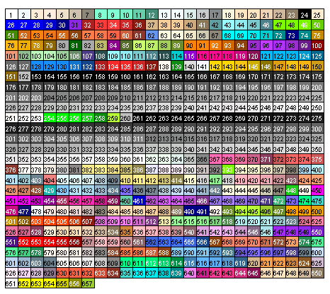

```{r setup, include=FALSE, purl=FALSE}
library(leaflet)
library(dplyr)
library(tidyr)
library(lubridate)
library(vioplot)

options(htmltools.dir.version = FALSE)
knitr::opts_chunk$set(comment = "##",
                      cache = T,
                      fig.align = "center",
                      dev = "svg")

# Function to plot prettier mtcars mpg by weight
myPlot <- function(...){
  plot(...,
       axes = F,
       xlim = c(1, 6),
       ylim = c(8, 35))
  box(lwd = 1.5)
  axis(side = 1, at = 1:6, labels = 1:6, lwd = 0, lwd.ticks = 1)
  axis(side = 2, at = seq(10, 35, 5), label = seq(10, 35, 5), lwd = 0, lwd.ticks = 1, las = 1)
}
```

```{css, echo=FALSE}
#data-visualization-in-base-r {
  font-size: 45px;
}

.code-overflow .remark-code,
.code-overflow .r,
.code-overflow .hljs {
  max-height: 250px;
  overflow: auto;
}
```

## Why use R for data visualization?

.smallish[
- R data visualization is extremely flexible! Almost any data visualization you can think of is possible to create in R

- Creating visualizations in R allows you to create dynamic plots that change with new data. This is useful when you want to create plots on a recurring basis (e.g., monthly revenue reports) or even realize that you missed some data initially. Repeat the same code every time!

.pull-left[
- There are dozens of packages that make it easier to create complex figures, including `ggplot2`, `patchwork`, `lattice`, `diagrammeR`, and more!

- Create interactive visualizations with `plotly`, `ggvis`, `htmlwidgets`, `leaflet`, `shiny` apps, and other R tools
]
.pull-right[
🧠 Psychology's new home
```{r, echo=F, fig.width = 5, fig.height=4}
leaflet() %>%
  addTiles() %>%
  addMarkers(lat = 47.6526131, lng = -122.3107631,
             popup = "Psychology's New Home",)
```
]
]

---
## The Generic `plot()` Function

Many data visualizations created in R start with the same function: `plot()`

`plot()` knows how to handle several different types of objects because it is a **generic function** with lots of methods:

```{r}
methods(plot)
```
---
# `plot()` Arguments
```{r, eval=F}
plot(x, y = NULL, type = "p",  xlim = NULL, ylim = NULL,
     log = "", main = NULL, sub = NULL, xlab = NULL, ylab = NULL,
     ann = par("ann"), axes = TRUE, frame.plot = axes,
     panel.first = NULL, panel.last = NULL, asp = NA,
     xgap.axis = NA, ygap.axis = NA,
     ...)
```

There are **a lot** of arguments to `plot()`!

Several of these arguments will be discussed in these slides, but not all of them. That means that making plots often involves teaching yourself something new each time with the help pages, Stack Overflow, and other various websites and blogs.

See `help(par)` for a full list of graphical parameters, many of which can be used within the `...` argument


---
# Scatterplot

.pull-left[
.small[

```{r, eval=F}
# Vectors of coordinates
plot(x = mtcars$wt,
     y = mtcars$mpg)
```

```{r, eval=F}
# Formula (`y~x`)
plot(mtcars$mpg ~ mtcars$wt)
```

```{r, eval=F}
# Two-column dataframe of x, y coordinates
plot(mtcars[, c("wt", "mpg")])
```
]
]
.pull-right[
```{r, echo=F, fig.width = 6, fig.height = 4}
par(mar = c(5, 4, 0, 2) + 0.1)
plot(x = mtcars$wt,
     y = mtcars$mpg)
```
]

.smallish[
- What defaults do you notice?

  - Plots points (`type = "p"`) of a specific shape (`pch = 1 `)
  
  - Axis labels (R code supplied to the arguments)
  
  - No header (`main = NULL`)
  
  - Chooses axis ticks for you
  
  - ...and hundreds more!
]
---
# Plot Titles
--


.pull-left[
.small[
### Main Title
```{r,fig.width = 6, fig.height = 5}
plot(x = mtcars$wt, y = mtcars$mpg,
     main = "Vehicle Efficiency by Weight") #<<
```

]
]
--

.pull-right[
.small[
### Axis Titles
```{r, fig.width = 6, fig.height = 5}
plot(x = mtcars$wt, y = mtcars$mpg,
     main = "Vehicle Efficiency by Weight",
     xlab = "Vehicle Weight (1000 lbs)", #<<
     ylab = "Miles Per Gallon (MPG)") #<<
```
]
]
---
## Fixing Ugly Axes

.pull-left[
R default axes are not publication ready!

- The axes overlap with the box around the plot

- The y-axis tickmarks are vertical

- The axes are thin and hard to see

- The default tick marks may not be desirable

- The default tick labels may not be desirable

]

.pull-right[
```{r, echo=F, fig.width = 6, fig.height = 5}
plot(x = mtcars$wt, y = mtcars$mpg,
     main = "Vehicle Efficiency by Weight",
     xlab = "Vehicle Weight (1000 lbs)", #<<
     ylab = "Miles Per Gallon (MPG)") #<<
```
]

---
## `box()`

.small[
The `box()` function is responsible for placing a box around your points. There are several different box types (specified with the `bty` **b**ox **ty**pe argument):

.pull-left[
```{r, eval=F}
# full box (default)
plot.new()
box(bty = "o")
```

```{r, eval=F}
# bottom and left
plot.new()
box(bty = "L")
```

```{r, eval=F}
# top and right
plot.new()
box(bty = "7")
```

```{r, eval=F}
# top, left, and bottom
plot.new()
box(bty = "C")
```

```{r, eval=F}
# left, bottom, and right
plot.new()
box(bty = "U")
```
]


.pull-right[
```{r, echo=F, fig.height=1.30}
par(mar = c(0, 0, 0, 0)+.1)
plot.new()
box(bty = "o", lwd = 2)
```

```{r, echo=F, fig.height=1.30}
par(mar = c(0, 0, 0, 0)+.1)
plot.new()
box(bty = "L", lwd = 2)
```

```{r, echo=F, fig.height=1.30}
par(mar = c(0, 0, 0, 0)+.1)
plot.new()
box(bty = "7", lwd = 2)
```

```{r, echo=F, fig.height=1.30}
par(mar = c(0, 0, 0, 0)+.1)
plot.new()
box(bty = "C", lwd = 2)
```

```{r, echo=F, fig.height=1.30}
par(mar = c(0, 0, 0, 0)+.1)
plot.new()
box(bty = "U", lwd = 2)
```
]
]

---
## Fixing the `box()`
.small[
.pull-left[
```{r, eval = F}
plot(x = mtcars$wt, y = mtcars$mpg,
     main = "Vehicle Efficiency by Weight",
     xlab = "Vehicle Weight (1000 lbs)",
     ylab = "Miles Per Gallon (MPG)",
     axes = F) # do not plot axes #<<
```

```{r, echo=F, fig.width = 6, fig.height = 5}
plot(x = mtcars$wt, y = mtcars$mpg,
     main = "Vehicle Efficiency by Weight",
     xlab = "Vehicle Weight (1000 lbs)",
     ylab = "Miles Per Gallon (MPG)",
     axes = F)
```
]

.pull-right[
```{r, eval = F}
plot(x = mtcars$wt, y = mtcars$mpg,
     main = "Vehicle Efficiency by Weight",
     xlab = "Vehicle Weight (1000 lbs)",
     ylab = "Miles Per Gallon (MPG)",
     axes = F)
box() # plot box #<<
```

```{r, echo=F, fig.width = 6, fig.height = 5}
plot(x = mtcars$wt, y = mtcars$mpg,
     main = "Vehicle Efficiency by Weight",
     xlab = "Vehicle Weight (1000 lbs)",
     ylab = "Miles Per Gallon (MPG)",
     axes = F)
box()
```
]
]
---
## Add the axes back in
.small[
.pull-left[
### x-axis
```{r, eval = F}
plot(...,
     axes = F,
     xlim = c(1, 6)) #<<

box()

axis(side = 1, # x-axis #<<
     at = 1:6, # ticks at 1 through 6 #<<
     labels = 1:6, # labels numbers 1 through 6 #<<
     lwd = 0, # do not plot axis #<<
     lwd.ticks = 1) # plot tick marks #<<
```

```{r, echo=F, fig.width = 6, fig.height = 3.5}
par(mar = c(5, 4, 0, 2) + 0.1)
plot(x = mtcars$wt, y = mtcars$mpg,
     xlab = "Vehicle Weight (1000 lbs)",
     ylab = "Miles Per Gallon (MPG)",
     axes = F,
     xlim = c(1, 6))
box()
axis(side = 1, at = 1:6, labels = 1:6,lwd = 0, lwd.ticks = 1)
```
]

.pull-right[
### y-axis
```{r, eval = F}
plot(...,
     axes = F,
     xlim = c(1, 6),
     ylim = c(10, 35)) #<<
box()
axis(side = 1, at = 1:6, labels = 1:6,lwd = 0, lwd.ticks = 1)
axis(side = 2, # y-axis #<<
     at = seq(10, 35, 5), # ticks every 5 points #<<
     labels = seq(10, 35, 5), # labels 10:35 by 5 #<<
     lwd = 0, lwd.ticks = 1, #<<
     las = 1) # horizonal tick labels #<<
```

```{r, echo=F, fig.width = 6, fig.height = 3.5}
par(mar = c(5, 4, 0, 2) + 0.1)
plot(x = mtcars$wt, y = mtcars$mpg,
     # main = "Vehicle Efficiency by Weight",
     xlab = "Vehicle Weight (1000 lbs)",
     ylab = "Miles Per Gallon (MPG)",
     axes = F,
     xlim = c(1, 6),
     ylim = c(10, 35))
box()
axis(side = 1, at = 1:6, labels = 1:6,lwd = 0, lwd.ticks = 1)
axis(side = 2, # y-axis #<<
     at = seq(10, 35, 5), # ticks every 5 points #<<
     lwd = 0, # do not plot axis #<<
     lwd.ticks = 1, # plot tick marks #<<
     las = 1) # horizonal tick labels #<<
```
]
]

---
## Change `box()` width and line type

.small[
.pull-left[
```{r, eval=F}
box(bty = "o",
    lwd = 3,
    lty = 1)
```

```{r, eval=F}
box(bty = "o",
    lwd = 3,
    lty = 2)
```

```{r, eval=F}
box(bty = "o",
    lwd = 3,
    lty = 3)
```

```{r, eval=F}
box(bty = "o",
    lwd = 3,
    lty = 4)
```

```{r, eval=F}
box(bty = "o",
    lwd = 3,
    lty = 5)
```

```{r, eval=F}
box(bty = "o",
    lwd = 3,
    lty = 6)
```

]

.pull-right[

```{r, echo=F, fig.height=1.34}
par(mar = c(0, 0, 0, 0)+.1)
plot.new()
box(bty = "o", lwd = 3, lty = 1)
```

```{r, echo=F, fig.height=1.34}
par(mar = c(0, 0, 0, 0)+.1)
plot.new()
box(bty = "o", lwd = 3, lty = 2)
```

```{r, echo=F, fig.height=1.34}
par(mar = c(0, 0, 0, 0)+.1)
plot.new()
box(bty = "o", lwd = 3, lty = 3)
```

```{r, echo=F, fig.height=1.34}
par(mar = c(0, 0, 0, 0)+.1)
plot.new()
box(bty = "o", lwd = 3, lty = 4)
```

```{r, echo=F, fig.height=1.34}
par(mar = c(0, 0, 0, 0)+.1)
plot.new()
box(bty = "o", lwd = 3, lty = 5)
```

```{r, echo=F, fig.height=1.34}
par(mar = c(0, 0, 0, 0)+.1)
plot.new()
box(bty = "o", lwd = 3, lty = 6)
```
]
]


---
## Point and Line Types
```{r, echo=F, fig.align='center', fig.width=14, fig.height=9.75}
par(mar = c(0, 4, 0, 2) + 0.1)

plot(NA,
     xlim = c(0, 21),
     ylim = c(0.5, 6.5),
     axes = F,
     ylab = "",
     xlab = "")
axis(2, at = 1:6, labels = c("pch" , "col" , "cex" , "lty", "type" , "lwd" ), 
     lwd = 0, las = 1, cex.axis = 1.5)

num <- 0
for(i in 1:20){
  # pch
  points(i , 1, pch = i, cex = 4)
  text(i, 1.3, i, cex = 1.5)
  
  # col
  points(i, 2, col = rainbow(n = 20)[i], pch = 15, cex = 4)
  text(i, 2.3, i, cex = 1.5)
  
  # cex
  points(i, 3, pch = 16, cex = i/4)
  text(i, 3.35, i/4, srt = -45, cex = 1.25)
  
  # lty
  if(i %in% seq(1, 18, 3)){
    num <- which(i == seq(1, 18, 3))
    points(i + c(.5, 3), c(4, 4), lty = num, type = "l", lwd = 2)
    text(i + 1.75, 4.15, num, cex = 1.25)
  }
  
  # type and lwd
  if(i %in% seq(1, 20, 5)){
    num <- which(i == seq(1, 20, 5))
    
    # type
    points(i + 0:3, rep(5, 4), type = c("p", "l", "b", "o")[num], lwd = 2)
    text(i + 1.50, 5.25, c("p","l","b","o")[num], cex = 1.25)
    
    # lwd
    points(i + 0:3, rep(6, 4), type = "l", lwd = num)
    text(i + 1.50, 6.25, c("p","l","b","o")[num], cex = 1.25)
  }
}

```

---
## Adjusting Point Shape with `pch`
.smallish[
```{r, eval=F}
plot(x = mtcars$wt, y = mtcars$mpg,
     main = "Vehicle Efficiency by Weight",
     xlab = "Vehicle Weight (1000 lbs)",
     ylab = "Miles Per Gallon (MPG)",
     cex = 1.25, # size #<<
     pch = 16) # shape #<<
```

```{r, echo=F, fig.width = 6, fig.height = 3.7}
myPlot(x = mtcars$wt, y = mtcars$mpg,
       main = "Vehicle Efficiency by Weight",
       xlab = "Vehicle Weight (1000 lbs)",
       ylab = "Miles Per Gallon (MPG)",
       cex = 1.25,
       pch = 16)
```
]

---
## `pch` is customizable

.pull-left[
.small[
```{r, eval=F}
plot(x = mtcars$wt, y = mtcars$mpg,
     main = "Vehicle Efficiency by Weight",
     xlab = "Vehicle Weight (1000 lbs)",
     ylab = "Miles Per Gallon (MPG)",
     cex = 1.5,
     pch = "+") #<<
```

```{r, echo=F, fig.width = 6, fig.height = 5}
myPlot(x = mtcars$wt, y = mtcars$mpg,
       main = "Vehicle Efficiency by Weight",
       xlab = "Vehicle Weight (1000 lbs)",
       ylab = "Miles Per Gallon (MPG)",
       cex = 1.5,
       pch = "+") #<<
```
]
]

.pull-right[
.small[
```{r, eval=F}
plot(x = mtcars$wt, y = mtcars$mpg,
     main = "Vehicle Efficiency by Weight",
     xlab = "Vehicle Weight (1000 lbs)",
     ylab = "Miles Per Gallon (MPG)",
     cex = 1.5,
     pch = "🛻") # truck emoji  #<<
```

```{r, echo=F, fig.width = 6, fig.height = 5}
myPlot(x = mtcars$wt, y = mtcars$mpg,
       main = "Vehicle Efficiency by Weight",
       xlab = "Vehicle Weight (1000 lbs)",
       ylab = "Miles Per Gallon (MPG)",
       cex = 1.5,
       pch = "🛻") #<<
```
]
]

---
## `pch` is vectorized
.pull-left[
.small[
```{r, echo=T, eval=F}
plot(x = mtcars$wt, y = mtcars$mpg,
     main = "Vehicle Efficiency by Weight",
     xlab = "Vehicle Weight (1000 lbs)",
     ylab = "Miles Per Gallon (MPG)",
     cex = 1.25,
     pch = 1:nrow(mtcars)) #<<
```
]
]

.pull-right[
.small[
👈 Because there are only 1:20 valid values of `pch`, R will give you a warning and recycle the 1:20 vector

👈 Each value 1:20 maps onto the element passed to `x` and `y`
]
]

```{r, echo=F, fig.width = 6, fig.height = 3.7, warning=FALSE}
myPlot(x = mtcars$wt, y = mtcars$mpg,
     main = "Vehicle Efficiency by Weight",
     xlab = "Vehicle Weight (1000 lbs)",
     ylab = "Miles Per Gallon (MPG)",
     cex = 1.25,
     pch = 1:nrow(mtcars)) #<<
```
---
## Adding lines to your plot

.small[
There are *many* ways to add lines to a plot in R. Some of the most common lines are vertical or horizontal lines, regression lines, and local regression (LOWESS) lines.

The `abline()` function can take either **(a)** a fitted regression object, **(b)** the intercept (`a`) and slope (`b`) values, **(c)** a y-axis value for horizontal lines (`h`), or **(d)** an x-axis value for vertical lines (`v`).

For example, to add lines at the mean of x and y:
```{r, eval=F}
plot(...)
abline(v = mean(mtcars$wt, na.rm = T),
       h = mean(mtcars$mpg, na.rm = T),
       lty = 3)
```

```{r, echo=F, fig.width = 6, fig.height = 2.75, warning=FALSE}
par(mar = c(4, 4, .1, 2) + 0.1)
myPlot(x = mtcars$wt, y = mtcars$mpg,
     xlab = "Vehicle Weight (1000 lbs)",
     ylab = "Miles Per Gallon (MPG)",
     cex = 1.25,
     pch = 16)
abline(v = mean(mtcars$wt, na.rm = T),
       h = mean(mtcars$mpg, na.rm = T),
       lty = 3)
```
]
---
## `matlines()`

.small[

```{r, eval=F}
plot(...)

fit <- lm(mpg ~ wt,
          data = mtcars)

new_wt <- seq(1, 6, .05)
pred <- predict(fit,
                newdata = data.frame(wt = new_wt),
                interval = "confidence",
                level = 0.95)

# Plots multiple lines based on a matrix of cols (with x and y line coords)
matlines(new_wt, pred,  lty = c(1, 3, 3), lwd = 1.5, col = c("black", "blue", "blue"))
```

```{r, echo=F, fig.width = 6, fig.height = 3, warning=FALSE}
par(mar = c(5, 4, .1, 2) + 0.1)
myPlot(x = mtcars$wt, y = mtcars$mpg,
     xlab = "Vehicle Weight (1000 lbs)",
     ylab = "Miles Per Gallon (MPG)",
     cex = 1.25,
     pch = 16)

fit <- lm(mpg ~ wt,
          data = mtcars)

new_wt <- seq(1, 6, .05)
pred <- predict(fit,
                newdata = data.frame(wt = new_wt),
                interval = "confidence",
                level = 0.95)

# Plots multiple lines based on a matrix of cols (with x and y line coords)
matlines(new_wt, pred,  lty = c(1, 3, 3), lwd = 1.5, col = c("black", "blue", "blue"))
```
]
---
# `lines()`

.smallish[
The `lines()` function is a generic function that takes either `x` and `y` coordinates to plot a line (similar to `matlines()`) or a formula to compute these coordinates

For example, let's draw a box around the three heaviest cars:

```{r, eval=F}
plot(...)

lines(x = c(5.1, 5.6, 5.6, 5.1, 5.1),
      y = c(17, 17, 8, 8, 17))
```

```{r, echo=F, fig.width = 8, fig.height = 3.25, warning=FALSE}
par(mar = c(5, 4, .1, 2) + 0.1)
myPlot(x = mtcars$wt, y = mtcars$mpg,
     xlab = "Vehicle Weight (1000 lbs)",
     ylab = "Miles Per Gallon (MPG)",
     cex = 1.25,
     pch = 16)

lines(x = c(5.1, 5.6, 5.6, 5.1, 5.1),
      y = c(17, 17, 8, 8, 17))
```

]

---
## Adjusting Point Colors with `col`

.pull-left[
.small[
```{r, eval=F}
plot(x = mtcars$wt, y = mtcars$mpg,
     main = "Vehicle Efficiency by Weight",
     xlab = "Vehicle Weight (1000 lbs)",
     ylab = "Miles Per Gallon (MPG)",
     cex = 1.5,
     pch = 16,
     col = "purple") #<<
```

```{r, echo=F, fig.width = 6, fig.height = 5}
myPlot(x = mtcars$wt, y = mtcars$mpg,
     main = "Vehicle Efficiency by Weight",
     xlab = "Vehicle Weight (1000 lbs)",
     ylab = "Miles Per Gallon (MPG)",
     cex = 1.5,
     pch = 16,
     col = "purple") #<<
```
]
]
.pull-right[
.small[
```{r, eval=F}
plot(x = mtcars$wt, y = mtcars$mpg,
     main = "Vehicle Efficiency by Weight",
     xlab = "Vehicle Weight (1000 lbs)",
     ylab = "Miles Per Gallon (MPG)",
     cex = 1.5,
     pch = 16,
     col = "orange") #<<
```

```{r, echo=F, fig.width = 6, fig.height = 5}
myPlot(x = mtcars$wt, y = mtcars$mpg,
     main = "Vehicle Efficiency by Weight",
     xlab = "Vehicle Weight (1000 lbs)",
     ylab = "Miles Per Gallon (MPG)",
     cex = 1.5,
     pch = 16,
     col = "orange") #<<
```

]
]

---
# R's Colors

R has built-in colors that can be accessed by name or by index with the `col` argument (we did this in the previous slide). To see the list of all `r length(colors())` colors, use the `colors()` function, or [see this PDF](http://www.stat.columbia.edu/~tzheng/files/Rcolor.pdf).

<div style="text-align:center">

</div>
 
---
## HTML Color Codes

R can also take hex codes or RGB (red, blue, green) color codes, which gives you access to infinite colors. Use [this tool](https://htmlcolorcodes.com/) to help you find exactly the color you want.

When you use RGB color codes you can also specify the **alpha channel**, which gives the colors transparency (this is also possible with HEX codes, just harder)

.pull-left[
.small[
```{r, echo=T, eval=F}
plot(x = mtcars$wt, y = mtcars$mpg,
     main = "Vehicle Efficiency by Weight",
     xlab = "Vehicle Weight (1000 lbs)",
     ylab = "Miles Per Gallon (MPG)",
     cex = 1.5, pch = 16,
     col = "#4b2e83") # UW purple #<<
```

```{r, echo=T, eval=F}
plot(x = mtcars$wt, y = mtcars$mpg,
     main = "Vehicle Efficiency by Weight",
     xlab = "Vehicle Weight (1000 lbs)",
     ylab = "Miles Per Gallon (MPG)",
     cex = 1.5, pch = 16,
     col = rgb(51, 0, 111,  # UW purple #<<
               maxColorValue = 255)) #<<
```
]
]

.pull-right[
```{r, echo=F, fig.width = 6, fig.height = 5}
myPlot(x = mtcars$wt, y = mtcars$mpg,
     main = "Vehicle Efficiency by Weight",
     xlab = "Vehicle Weight (1000 lbs)",
     ylab = "Miles Per Gallon (MPG)",
     cex = 1.5,
     pch = 16,
     col = "#4b2e83")
```
]
---
## Transparency with Alpha

.smallish[
```{r, eval=F}
plot(x = mtcars$wt, y = mtcars$mpg,
     main = "Vehicle Efficiency by Weight",
     xlab = "Vehicle Weight (1000 lbs)",
     ylab = "Miles Per Gallon (MPG)",
     cex = 1.5, pch = 16,
     col = rgb(51, 0, 111, 255*.5, # 0 = transparent, 1 = completely opaque #<<
               maxColorValue = 255)) #<<
```

```{r, echo=F, fig.width = 6, fig.height = 3.7}
myPlot(x = mtcars$wt, y = mtcars$mpg,
     main = "Vehicle Efficiency by Weight",
     xlab = "Vehicle Weight (1000 lbs)",
     ylab = "Miles Per Gallon (MPG)",
     cex = 1.5, pch = 16,
     col = rgb(51, 0, 111, 255*.5,
               maxColorValue = 255))
```
]

---
# R's Color Functions
.smallish[
- `rainbow()`: `n` colors (with `alpha` transparency) corresponding with the rainbow color spectrum

- `heat.colors()`: `n` colors (with `alpha` transparency) ranging from red to light yellow

- `terrain.colors()`: `n` colors (with `alpha` transparency) corresponding with terrain map colors

- `topo.colors()`: `n` colors (with `alpha` transparency) corresponding with topography map colors

- `cm.colors()`: `n` colors (with `alpha` transparency) ranging from cyan to magenta

- `hcl()`: create vector of colors from vectors specifying hue (`h`), chroma (`c`), and luminance (`l`)

- RColorBrewer: An R package with convenient color scheme and functions. See `RColorBrewer::display.brewer.all()` to plot the available color palettes.
]
---
## `col` is vectorized

.small[

The `col` argument is vectorized, which means you can do things like create another dimension (color) in your data to represent more information. For example, using `heat.colors()`, we will color the fastest 1/4 mile time red and the slowest light yellow:

```{r, eval=F}
plot(x = mtcars[order(mtcars$qsec), c("wt", "mpg")], # order rows by qsec #<<
     main = "Vehicle Efficiency by Weight",
     xlab = "Vehicle Weight (1000 lbs)",
     ylab = "Miles Per Gallon (MPG)",
     pch = 16, cex = 1.50,
     col = heat.colors(length(mtcars$wt), alpha = .75)) #<<
```

```{r, echo=F, fig.width = 6, fig.height = 3.25}
myPlot(x = mtcars[order(mtcars$qsec), c("wt", "mpg")], # order rows by qsec #<<
     main = "Vehicle Efficiency by Weight",
     xlab = "Vehicle Weight (1000 lbs)",
     ylab = "Miles Per Gallon (MPG)",
     pch = 16, cex = 1.50,
     col = heat.colors(length(mtcars$wt), alpha = .75)) #<<
```
]
---
## `cex` is vectorized
.small[
The `cex` argument is also vectorized and can be used to create new dimensions in your figures. In this plot, larger points represent faster 1/4 mile times.
```{r, eval=F}
plot(x = mtcars[order(mtcars$qsec), c("wt", "mpg")], # order rows by qsec #<<
     main = "Vehicle Efficiency by Weight",
     xlab = "Vehicle Weight (1000 lbs)",
     ylab = "Miles Per Gallon (MPG)",
     pch = 16,
     cex = seq(3.5, 1.25, length.out = nrow(mtcars)), #<<
     col = rgb(0, 0, 0, .5))
```

```{r, echo=F, fig.width = 6, fig.height = 3.25}
myPlot(x = mtcars[order(mtcars$qsec), c("wt", "mpg")], # order rows by qsec #<<
     main = "Vehicle Efficiency by Weight",
     xlab = "Vehicle Weight (1000 lbs)",
     ylab = "Miles Per Gallon (MPG)",
     pch = 16,
     cex = seq(3.5, 1.25, length.out = nrow(mtcars)), #<<
     col = rgb(0, 0, 0, .5))
```
]
---
# Creating Grids

.small[
```{r, eval = F}
grid(nx = NULL, ny = nx, col = "lightgray", lty = "dotted",
     lwd = par("lwd"), equilogs = TRUE)
```

By default the number of lines in the x and y directions will match the number of tick marks

.pull-left[
```{r, eval=F}
plot(...)
grid(col = "gray48")
```

```{r, echo=F, fig.width = 6, fig.height = 4.5}
myPlot(x = mtcars[order(mtcars$qsec), c("wt", "mpg")], # order rows by qsec #<<
     main = "Vehicle Efficiency by Weight",
     xlab = "Vehicle Weight (1000 lbs)",
     ylab = "Miles Per Gallon (MPG)",
     pch = 16,
     cex = seq(3.5, 1.25, length.out = nrow(mtcars)), #<<
     col = rgb(0, 0, 0, .5))
grid(col = "gray48")
```

☝️Problem: gridlines  placed on top of the points
]

.pull-right[
```{r, eval=F}
plot(..., type = "n") # do not plot points #<<
grid(col = "gray48")
points(x = mtcars[order(mtcars$qsec), c("wt", "mpg")], #<<
       pch = 16, #<<
       cex = seq(3.5, 1.25, length.out = nrow(mtcars)), #<<
       col = rgb(0, 0, 0, .5)) #<<
```

```{r, echo=F, fig.width = 6, fig.height = 4}
myPlot(x = mtcars[order(mtcars$qsec), c("wt", "mpg")], # order rows by qsec #<<
     main = "Vehicle Efficiency by Weight",
     xlab = "Vehicle Weight (1000 lbs)",
     ylab = "Miles Per Gallon (MPG)",
     pch = 16,
     cex = seq(3.5, 1.25, length.out = nrow(mtcars)), #<<
     col = rgb(0, 0, 0, .5),
     type = "n")
grid(col = "gray48")
points(x = mtcars[order(mtcars$qsec), c("wt", "mpg")],
       pch = 16,
       cex = seq(3.5, 1.25, length.out = nrow(mtcars)),
       col = rgb(0, 0, 0, .5))
```
]
]

---
# Plot Background

.small[
To change the background of *just the plot region* (i.e., where the points go), you need to:

1. Create an empty plot
2. Create a rectangle using `rect()` of the plotting region
3. Create points (and anything else you want to plot) over the rectangle

.pull-left[
```{r, eval=F}
plot(..., type = "n")

rect(xleft = par("usr")[1], #<<
     ybottom = par("usr")[3], #<<
     xright = par("usr")[2], #<<
     ytop = par("usr")[4], #<<
     col = "black") #<<

points(x = mtcars[order(mtcars$qsec), c("wt", "mpg")],
       pch = 16,
       cex = seq(3.5, 1.25, length.out = nrow(mtcars)),
       col = rgb(255, 252, 245, 255*.5, maxColorValue = 255))
```
]

.pull-right[
```{r, echo=F, fig.align='center', fig.height=6}
par(mar = c(5, 4, 0, 2) + 0.1,
    cex = 1.25)
myPlot(x = mtcars[order(mtcars$qsec), c("wt", "mpg")], # order rows by qsec #<<
     xlab = "Vehicle Weight (1000 lbs)",
     ylab = "Miles Per Gallon (MPG)",
     type = "n")
rect(xleft = par("usr")[1],
     ybottom = par("usr")[3],
     xright = par("usr")[2],
     ytop = par("usr")[4],
     col = "black")
points(x = mtcars[order(mtcars$qsec), c("wt", "mpg")],
       pch = 16,
       cex = seq(3.5, 1.25, length.out = nrow(mtcars)),
       col = rgb(255, 252, 245, 255*.5, maxColorValue = 255))
```
]
]

---
### Plotting Area Background

Changing the background of the entire plotting area is much easier than changing just the plotting region

.small[
```{r, eval=F}
par("bg" = "black", # Change background color
    "fg" = "white") # Change foreground color (box, axes, tick marks)

plot(...,
     col = "white",      # Points
     col.main = "white", # Main title
     col.lab = "white",  # Axis labels
     col.axis = "white") # Tick labels
```


```{r, echo=F, fig.align='center', fig.width=14, fig.height=5.5}
par("bg" = "black",
    "fg" = "white",
    cex = 1.25)
myPlot(x = mtcars[order(mtcars$qsec), c("wt", "mpg")],
     main = "Vehicle Efficiency by Weight",
     xlab = "Vehicle Weight (1000 lbs)",
     ylab = "Miles Per Gallon (MPG)",
     pch = 16,
     cex = seq(3.5, 1.25, length.out = nrow(mtcars)),
     col = rgb(255, 252, 245, 255*.5, maxColorValue = 255), # Points
     col.main = "white", # Main title
     col.lab = "white",  # Axis labels
     col.axis = "white")
axis(side = 1, at = 1:6, labels = 1:6, lwd = 0, lwd.ticks = 1, col.axis = "white")
axis(side = 2, at = seq(10, 35, 5), label = seq(10, 35, 5), lwd = 0, lwd.ticks = 1, las = 1, col.axis = "white")
```


]

---
# Legends

.small[
```{r, eval=F}
plot(x = mtcars[order(mtcars$cyl), c("wt", "mpg")], # order rows by cyl
     col = rep(hcl.colors(3, alpha = .6), times = table(mtcars$cyl)), # color by cyl
     ...) # color by cyl

legend(x = "topright", # takes keywords OR x, y coordinates
       title = "Cylinders", # legend title
       legend = seq(4, 8, 2), # values inside legend
       col = hcl.colors(3, alpha = .75), # colors corresponding with values
       horiz = T, # plot legend horizontally
       pch = 16) # shape of legend point
```


```{r, echo=F, fig.width = 6, fig.height = 3.25}
myPlot(x = mtcars[order(mtcars$cyl), c("wt", "mpg")], # order rows by qsec #<<
     main = "Vehicle Efficiency by Weight",
     xlab = "Vehicle Weight (1000 lbs)",
     ylab = "Miles Per Gallon (MPG)",
     pch = 16, cex = 1.50,
     col = rep(hcl.colors(3, alpha = .6), times = table(mtcars$cyl))) #<<

legend(x = "topright",
       legend = seq(4, 8, 2),
       title = "Cylinders",
       col = hcl.colors(3, alpha = .75),
       horiz = T,
       pch = 16,
       pt.cex = 1.25)
```
]

---
# Adding Text to Plots

.small[
```{r, eval=F}
plot(...)

text(x = mtcars[, c("wt", "mpg")], # x,y coordinates of labels
     labels = mtcars$cyl,
     col = "white",
     cex = .75)
```


```{r, echo=F, fig.width = 6, fig.height = 4}
myPlot(x = mtcars[, c("wt", "mpg")], 
     main = "Vehicle Efficiency by Weight",
     xlab = "Vehicle Weight (1000 lbs)",
     ylab = "Miles Per Gallon (MPG)",
     pch = 16, cex = 2)

text(x = mtcars[, c("wt", "mpg")],
     labels = mtcars$cyl,
     col = "white",
     cex = .75)
```
]

---
# Labeling Specific Points

.small[
```{r, eval=F}
plot(...)

text(x = mtcars[mtcars$mpg %in% c(min(mtcars$mpg), max(mtcars$mpg)), c("wt", "mpg")],
     labels = rownames(mtcars)[mtcars$mpg %in% c(min(mtcars$mpg), max(mtcars$mpg))],
     cex = .75,
     pos = c(2, 1, 2))
```

```{r, echo=F, fig.width = 6, fig.height = 4}
plot(x = mtcars[, c("wt", "mpg")],
     main = "Vehicle Efficiency by Weight",
     xlab = "Vehicle Weight (1000 lbs)",
     ylab = "Miles Per Gallon (MPG)",
     pch = 16, cex = 2,
     axes = F,
     xlim = c(.75, 6.1),
     ylim = c(5, 35),
     col = rgb(0, 0, 0, .75))
box(lwd = 1.5)
axis(side = 1, at = 1:6, labels = 1:6, lwd = 0, lwd.ticks = 1)
axis(side = 2, at = seq(10, 35, 5), label = seq(10, 35, 5), lwd = 0, lwd.ticks = 1, las = 1)


text(x = mtcars[mtcars$mpg %in% c(min(mtcars$mpg), max(mtcars$mpg)), c("wt", "mpg")],
     labels = rownames(mtcars)[mtcars$mpg %in% c(min(mtcars$mpg), max(mtcars$mpg))],
     cex = .75,
     pos = c(2, 1, 2)) # label offset from x, y coords
```
]

---
## Margin text with `mtext()`

.small[
Sometimes you want to put text in the margins of the plot (e.g., when you have multiple plots and you want to give them all one title). For that you can use the `mtext()` function (for **m**argin **text**).

```{r, eval = F}
for(i in 1:4){
  mtext(paste0("mtext(..., side = ", i, ")"), side = i)
}
```
]

```{r, echo=F, fig.width = 6, fig.height = 4}
plot(x = mtcars[, c("wt", "mpg")],
     main = "Vehicle Efficiency by Weight",
     xlab = "Vehicle Weight (1000 lbs)",
     ylab = "Miles Per Gallon (MPG)",
     pch = 16,
     axes = F,
     xlim = c(.75, 6.1),
     ylim = c(5, 35),
     cex = seq(3.5, 1.25, length.out = nrow(mtcars)), #<<
     col = rgb(0, 0, 0, .5))
box(lwd = 1.5)
for(i in 1:4){
  mtext(paste0("mtext(..., side = ", i, ")"), side = i)
}
```

---
# Changing Fonts

.smallish[
Changing font size and style is easy, but changing font family is a bit trickier because it depends on the fonts you have installed on your operating system

The `extrafont` package extends the fonts available for plotting in R. First, install the package with `install.packages("extrafont")` then import the fonts with `extrafont::font_import()`


******
Font `par` arguments:

- `font`: Integer which specifies which font style to use for text
  - 1 = plain
  - 2 = **bold**
  - 3 = *italic*
  - 4 = __*bold italic*__

- `font.axis`: Integer which specifies which font to use for axis annotation

- `font.lab`: Integer which specifies which font to use for x and y labels (axis labels)

- `font.main`: Integer which specifies which font to use for main titles

- `font.sub`: Integer which specifies which font to use for subtitles

]
---

.smallish[
```{r, eval=F}
plot(...,
     family = "Ubuntu", # Ubuntu font
     font.main = 4, # Title (bold, italic)
     font.axis = 2, # Axis tick mark labels (bold)
     font.lab = 4) # Axis labels (bold italic)
```
]


```{r, eval=T, echo=F, fig.width = 6, fig.height = 4}
plot(x = mtcars[order(mtcars$qsec), c("wt", "mpg")],
     main = "Vehicle Efficiency by Weight",
     xlab = "Vehicle Weight (1000 lbs)",
     ylab = "Miles Per Gallon (MPG)",
     xlim = c(1, 6),
     pch = 16,
     cex = seq(3.5, 1.25, length.out = nrow(mtcars)), #<<
     col = rgb(0, 0, 0, .5),
     axes = F,
     family = "Ubuntu", # Ubuntu font
     font.main = 4, # Bold, italics title
     font.lab = 4)

box(lwd = 1.5)
axis(side = 1, at = 1:6, labels = 1:6, lwd = 0, lwd.ticks = 1, font.axis = 2)
axis(side = 2, at = seq(10, 35, 5), label = seq(10, 35, 5), lwd = 0, lwd.ticks = 1, las = 1, font.axis = 2)
```

---
## Multiple Plots in Same Window
.small[

There are two primary ways of creating multiple figures within the same window in R:
- `par`'s `mfrow` and `mfcol` arguments
- the `layout()` function

******

### `mfrow` and `mfcol`

These functions take a vector of two elements (nrow, ncol) and draw a grid on the graphing screen that is filled with figures by row (`mfrow`) or by column (`mfcol`)

.pull-left[
```{r, eval = F}
par(mfrow = c(2, 4)
```

```{r, eval=T, echo = F, fig.width = 6, fig.height = 4}
par(mfrow = c(2, 4),
    mar = c(0, 0, 0, 0) + 0.2)
for(i in 1:8){
  plot.new()
  box(lwd = 2)
  
  rect(xleft = par("usr")[1],
     ybottom = par("usr")[3],
     xright = par("usr")[2],
     ytop = par("usr")[4],
     col = rainbow(8, alpha = .5)[i])
  
  text(.5, .5, paste("Fig.", i), cex = 2)
}
```
]

.pull-right[
```{r, eval = F}
par(mfcol = c(2, 4)
```

```{r, eval=T, echo = F, fig.width = 6, fig.height = 4}
par(mfcol = c(2, 4),
    mar = c(0, 0, 0, 0) + 0.2)
for(i in 1:8){
  plot.new()
  box(lwd = 2)
  
  rect(xleft = par("usr")[1],
     ybottom = par("usr")[3],
     xright = par("usr")[2],
     ytop = par("usr")[4],
     col = rainbow(8, alpha = .5)[i])
  
  text(.5, .5, paste("Fig.", i), cex = 2)
}
```
]
]
---
## `mfrow`/`mfcol` example:

.small[
```{r, eval=F}
par(mfrow = c(2, 4))
for(i in 1:8){
  plot(mtcars[, c(i, i+1)],
       main = paste(colnames(mtcars[, c(i+1, i)]),
                    collapse = " ~ "))
}
```


```{r, eval=T, echo = F, fig.width = 7, fig.height = 4}
par(mfrow = c(2, 4),
    mar = c(3, 2, 1, 1) + 0.2)
for(i in 1:8){
  plot(mtcars[, c(i, i+1)],
       main = paste(colnames(mtcars[, c(i+1, i)]),
                    collapse = " ~ "))
}
```
]

---
## Multiple figures with `layout()`

.small[
The `layout` function takes a matrix that specifies the location of the next *N* figures created **and** the order in which they will be placed. The `widths` and `heights` arguments take the relative (or in centimeters if you prefer) row/col widths. For example:

.pull-left[
```{r}
layout_mat <- matrix(c(3, 1,
                       6, 5,
                       4, 2),
                     nrow = 3,
                     byrow = T)

layout(layout_mat, c(1, 2), c(1, 1, 1))
```


```{r, echo=F, fig.width = 6, fig.height = 4.25}
layout_mat <- matrix(c(3, 1,
                       6, 5,
                       4, 2),
                     nrow = 3,
                     byrow = T)

layout(layout_mat, c(1, 2), c(1, 1, 1))

par(mar = c(0, 0, 0, 0) + 0.2)
for(i in 1:6){
  plot.new()
  box(lwd = 2)
  
  rect(xleft = par("usr")[1],
     ybottom = par("usr")[3],
     xright = par("usr")[2],
     ytop = par("usr")[4],
     col = rainbow(6, alpha = .5)[i])
  
  text(.5, .5, paste("Fig.", i), cex = 2)
}

```
]

.pull-right[
```{r}
layout_mat <- matrix(c(6, 5,
                       2, 1,
                       3, 4),
                     nrow = 3,
                     byrow = T)

layout(layout_mat, c(1, 2), c(1, 1, 1))
```


```{r, echo=F, fig.width = 6, fig.height = 4.25}
layout_mat <- matrix(c(6, 5,
                       2, 1,
                       3, 4),
                     nrow = 3,
                     byrow = T)

layout(layout_mat, c(1, 2), c(1, 1, 1))

par(mar = c(0, 0, 0, 0) + 0.2)
for(i in 1:6){
  plot.new()
  box(lwd = 2)
  
  rect(xleft = par("usr")[1],
     ybottom = par("usr")[3],
     xright = par("usr")[2],
     ytop = par("usr")[4],
     col = rainbow(6, alpha = .5)[i])
  
  text(.5, .5, paste("Fig.", i), cex = 2)
}

```
]
]
---
## Complex layouts with `layout()`
.small[

.pull-left[

```{r}
layout_mat <- matrix(c(1, 1,
                       2, 3,
                       4, 5),
                     nrow = 3,
                     byrow = T)

layout(layout_mat, c(1, 1), c(1, 1, 1))
```


```{r, echo=F, fig.width = 6, fig.height = 4.5}
# l <- layout(layout_mat, c(1, 1), c(1, 1))
# layout.show(l)
layout_mat <- matrix(c(1, 1,
                       2, 3,
                       4, 5),
                     nrow = 3,
                     byrow = T)

layout(layout_mat, c(1, 1), c(1, 1, 1))

par(mar = c(0, 0, 0, 0) + 0.2)
for(i in 1:5){
  plot.new()
  box(lwd = 2)
  
  rect(xleft = par("usr")[1],
     ybottom = par("usr")[3],
     xright = par("usr")[2],
     ytop = par("usr")[4],
     col = rainbow(6, alpha = .5)[i])
  
  text(.5, .5, paste("Fig.", i), cex = 2)
}

```
]

.pull-right[

```{r}
layout_mat <- matrix(c(1, 1,
                       2, 3,
                       4, 3),
                     nrow = 3,
                     byrow = T)

layout(layout_mat, c(1, 1), c(2, 1))
```


```{r, echo=F, fig.width = 6, fig.height = 4.5}
# l <- layout(layout_mat, c(1, 1), c(1, 1))
# layout.show(l)
layout_mat <- matrix(c(1, 1,
                       2, 3,
                       4, 3),
                     nrow = 3,
                     byrow = T)

layout(layout_mat, c(1, 1), c(2, 1))

par(mar = c(0, 0, 0, 0) + 0.2)
for(i in 1:4){
  plot.new()
  box(lwd = 2)
  
  rect(xleft = par("usr")[1],
     ybottom = par("usr")[3],
     xright = par("usr")[2],
     ytop = par("usr")[4],
     col = rainbow(6, alpha = .5)[i])
  
  text(.5, .5, paste("Fig.", i), cex = 2)
}

```
]
]

---
### Example: Adding Marginal Distributions

.small[


```{r, eval=F}
layout_mat <- matrix(c(2, 0,
                       1, 3),
                     nrow = 2 byrow = T)

layout(mat = layout_mat,
       widths = c(3, 0.5),
       heights =  c(1, 3))

```


```{r, echo=F, fig.width = 7, fig.height = 3.5, fig.align='center'}
layout_mat <- matrix(c(2, 0,
                       1, 3),
                     nrow = 2,
                     byrow = T)

layout(layout_mat, c(6, 1), c(1, 3))
par(mar = c(0, 0, 0, 0) + 0.2)
for(i in 1:3){
  plot.new()
  box(lwd = 2)
  
  rect(xleft = par("usr")[1],
     ybottom = par("usr")[3],
     xright = par("usr")[2],
     ytop = par("usr")[4],
     col = rainbow(6, alpha = .5)[i])
  
  if(i == 1) text(.5, .5, "Main Plot")
  if(i == 2) text(.5, .5, "x-axis marginal distribution")
  if(i == 3) text(.5, .5, "y-axis\nmarginal\ndistribution", srt = -90)
}
```
]
---
.smallish[
```{r, echo=T, eval=F}
# Plot main scatterplot
par(mar = c(5, 4, 1, 1) + 0.1)
plot(...)

# Add marginal rugs to x and y axes
rug(mtcars$wt, side = 1)
rug(mtcars$mpg, side = 2)

# Get densities of `wt` and `mpg`
d_wt <- density(mtcars[order(mtcars$qsec), "wt"])
d_mpg <- density(mtcars[order(mtcars$qsec), "mpg"])

par(mar = c(0,3,1,.1))
plot(d_wt, axes = F, main = "", xlab= "", ylab = "", lwd = 2)

par(mar = c(4.25,0,1,1))
plot(d_mpg$y, d_mpg$x, type="l", axes = F, main = "",
     xlab= "", ylab = "", lwd = 2)

```

]

---

```{r, echo=F, fig.width = 7, fig.height = 6, fig.align='right'}
layout_mat <- matrix(c(2, 0,
                       1, 3),
                     nrow = 2,
                     byrow = T)

layout(layout_mat, c(3, .75), c(.75, 3))


par(mar = c(5, 4, 1, 1) + 0.1)
plot(x = mtcars[order(mtcars$qsec), c("wt", "mpg")],
     xlab = "Vehicle Weight (1000 lbs)",
     ylab = "Miles Per Gallon (MPG)",
     xlim = c(1, 6),
     ylim = c(9.5, 35),
     pch = 16,
     cex = seq(3.5, 1.25, length.out = nrow(mtcars)), #<<
     col = rgb(0, 0, 0, .5),
     axes = F,
     family = "Ubuntu",
     font.main = 4,
     font.lab = 4)

box(lwd = 1.5)
axis(side = 1, at = 1:6, labels = 1:6, lwd = 0, lwd.ticks = 1, font.axis = 2)
axis(side = 2, at = seq(10, 35, 5), label = seq(10, 35, 5), lwd = 0, lwd.ticks = 1, las = 1, font.axis = 2)
rug(mtcars$wt, side = 1)
rug(mtcars$mpg, side = 2)

d_wt <- density(mtcars[order(mtcars$qsec), "wt"])
d_mpg <- density(mtcars[order(mtcars$qsec), "mpg"])

par(mar = c(0,3,1,.1))
plot(d_wt, axes = F, main = "", xlab= "", ylab = "", lwd = 2)

par(mar = c(4.25,0,1,1))
plot(d_mpg$y, d_mpg$x, type="l", axes = F, main = "", xlab= "", ylab = "", lwd = 2)
```

---
.small[
.pull-left[
# Plot Margins
### Inner Margins

**Inner margins** refer to the margins on each axis

`par("mar")` is a numerical vector corresponding with `c(bottom, left, top, right)` that specifies the number of lines of margin on each side of the plot (default = `c(5, 4, 4, 2) + 0.1`)

`par("mai")` is similar to `mar`, except the margins are specified in inches (default = `c(1.02, 0.82, 0.82, 0.42)`)


]


.pull-right[
<div style="margin-top: 50px;"></div>

```{r, echo=F, fig.width = 5, fig.height = 5, fig.align='center'}
par("oma" = c(2, 2, 2, 2))

plot(1,1,type="n",xlab="",ylab="",xaxt="n",yaxt="n")

text(.615, 1, "par(mar = c(5, 4, 4, 2) + 0.1,\n    oma = c(2, 2, 2, 2))",
     family = "Ubuntu Mono",
     pos = 4)

for(side in 1:4){
  inner <- round(par("mar")[side], 0) - 1
  
  for(line in 0:inner){
    mtext(text = paste("Inner line", line), side = side, line = line)
  }
  
  outer<-round(par("oma")[side], 0) - 1
   
  for(line in 0:inner){
    mtext(text=paste("Outer line", line), side = side, line = line, outer = TRUE, font = 2)
  }
}
```
]

### Outer Margins

**Outer margins** correspond with the entire plotting region, not just the axes

`par("oma")` is a numerical vector corresponding with `c(bottom, left, top, right)` that specifies the number of lines of margin on each side of the plot (default is no margin)

`par("omi")` is similar to `oma`, except the margins are specified in inches
]
---
### Example: Outer Margin Labels

.small[
```{r, eval=F}
par(..., oma = c(2, 2, 0, 4), family = "Ubuntu")

mtext(text="Vehicle Height (1000lbs)", side = 1, line = 0, outer = TRUE, font = 2)
mtext(text="Miles Per Gallon (MPG)", side = 2, line = 0, outer = TRUE, font = 2)
```
]

```{r, echo=F, fig.width = 7, fig.height = 4.5, fig.align='center'}
par(mfrow = c(2, 2),
    mar = c(3, 3, 2, 0),
    oma = c(2, 2, 0, 4),
    family = "Ubuntu")


# FIGURE 1
myPlot(x = mtcars[order(mtcars$qsec), c("wt", "mpg")],
     pch = 16,
     cex = seq(3.5, 1.25, length.out = nrow(mtcars)),
     col = rgb(0, 0, 0, .5),
     type = "n")
grid(col = "gray48")
points(x = mtcars[order(mtcars$qsec), c("wt", "mpg")],
       pch = 16,
       cex = seq(3.5, 1.25, length.out = nrow(mtcars)),
       col = rgb(0, 0, 0, .5))


# FIGURE 2
par(mar = c(3, 1.5, 2, 0))
plot(x = mtcars[order(mtcars$cyl), c("wt", "mpg")],
     pch = 16, cex = 1.50,
     col = rep(hcl.colors(3, alpha = .6), times = table(mtcars$cyl)),
     axes = F,
     xlim = c(1, 6),
     ylim = c(8, 35))

box(lwd = 1.5)
axis(side = 1, at = 1:6, labels = 1:6, lwd = 0, lwd.ticks = 1)
axis(side = 2, at = seq(10, 35, 5), label = rep("", length(seq(10, 35, 5))), lwd = 0, lwd.ticks = 1, las = 1)

legend(x = "topright",
       legend = seq(4, 8, 2),
       title = "Cylinders",
       col = hcl.colors(3, alpha = .75),
       horiz = T,
       pch = 16,
       pt.cex = 1.25)

# FIGURE 3
par(mar = c(3, 3, .5, 0))
myPlot(x = mtcars[order(mtcars$qsec), c("wt", "mpg")],
     pch = 16, cex = 1.50,
     col = heat.colors(length(mtcars$wt), alpha = .75))

# FIGURE 4
par(mar = c(3, 1.5, .5, 0))
plot(mtcars[, c("wt", "mpg")],
     pch = 16, cex = 2,
     axes = F,
     xlim = c(1, 6),
     ylim = c(8, 35), 
     xlab = "",
     ylab = "")
box(lwd = 1.5)
axis(side = 1, at = 1:6, labels = 1:6, lwd = 0, lwd.ticks = 1)
axis(side = 2, at = seq(10, 35, 5), label = rep("", length(seq(10, 35, 5))), lwd = 0, lwd.ticks = 1, las = 1)
text(x = mtcars[, c("wt", "mpg")],
     labels = mtcars$cyl,
     col = "white",
     cex = .75)

mtext(text="Vehicle Height (1000lbs)", side = 1, line = 0, outer = TRUE, font = 2, family = "Ubuntu")
mtext(text="Miles Per Gallon (MPG)", side = 2, line = 0, outer = TRUE, font = 2, family = "Ubuntu")
```

---
class: inverse
# Other Types of Plots
---
# Line Graph

.small[
The `Theoph` dataset in Base R has data from an experiment on the pharmacokinetics of theophylline (a medication for [lung diseases like COPD](https://www.webmd.com/drugs/2/drug-3591-3076/theophylline-oral/theophylline-sustained-release-oral/details)). Let's plot the mean theophylline concentration (mg/L) over time (within-subjects) by dose administered (between-subjects).

Data need to be in long form for line graphs

```{r, message=FALSE}
conc_data <- Theoph %>%
  mutate(Subject = as.numeric(Subject)) %>%
  group_by(Subject) %>%
  arrange(Time) %>%
  mutate(timepoint = 1:n()) %>%
  group_by(Dose, timepoint) %>%
  summarize(conc = mean(conc, na.rm = T),
            Time = mean(Time, na.rm = T))

glimpse(conc_data)
```
]
---
class: code-overflow

.small[
```{r, echo=T, fig.width = 8, fig.height = 3.5, fig.align='center'}
par(mar = c(5, 4, 0, 0))
par(family = "Ubuntu",
    font.lab = 4,
    cex.lab = 1.15)

# Plot empty plot with correct dimensions
plot(x = conc_data$Time, y = conc_data$conc, type = "n", axes = F,
     xlab = "Time (hours)", ylab = "Concentration (mg/L)",
     ylim = c(0, 12))
box(lwd = 1.5)
axis(side = 1, at = axTicks(1), labels = axTicks(1), lwd = 0, lwd.ticks = 1)
axis(side = 2, at = seq(0, 12, 2), labels = seq(0, 12, 2), lwd = 0, lwd.ticks = 1, las = 1)

# Plot line of each dose over time
# lines() is similar to points(type = "l")
for(i in 1:length(unique(conc_data$Dose))){
  lines(x = conc_data$Time[conc_data$Dose == unique(conc_data$Dose)[i]],
         y = conc_data$conc[conc_data$Dose == unique(conc_data$Dose)[i]],
         lwd = 2,
         col = rainbow(length(unique(conc_data$Dose)))[i])
}

# Add legend
legend(x = "topright",
       title = "Dose (mg/kg)",
       legend = format(unique(conc_data$Dose), nsmall = 2),
       col = rainbow(length(unique(conc_data$Dose)), alpha = .75),
       lwd = 2,
       lty = 1,
       bty = "n",
       ncol = 2)
```
]
---
### Plotting dates on the x-axis

.small[
When you have a `Date` column, R's `plot()` will automatically plot the dates properly on the x-axis. If you want to change the x-axis at all (labels, tick marks, other aesthetics), your best bet is to use the special `axis.Date()` function
```{r echo=F, message=FALSE}
# Seattle Police Use of Force Data
# Data retrieved from https://data.seattle.gov/Public-Safety/Police-Use-of-Force/g6s5-grjm
d <- read.csv("/home/adam/Downloads/Use_Of_Force.csv")

# Count use of force incidents by by incident type and subject race
counts <- d %>%
  distinct(Officer_ID, Subject_ID, .keep_all = T) %>% # remove duplicate entries
  mutate(Date = as_date(Occured_date_time, format = "%m/%d/%Y %I:%M:%S %p"),
         Year = year(Date),
         Month = month(Date),
         Incident_Type = gsub("^(Level [1-3]{1}).*", "\\1", .$Incident_Type)) %>%
  group_by(Year, Month, Incident_Type, Subject_Race) %>%
  summarize(n = n()) %>%
  group_by(Incident_Type) %>%
  complete(Year, Month, Subject_Race) %>%
  mutate(Date = as_date(paste(Year, Month, "01"), format = "%Y %m %d"),
         n = replace_na(n, 0))

```

```{r, eval=F}
# Axis ticks at each month Jan - Dec
axis.Date(
  # x-axis
  side = 1,
  
  # Date object to create axis
  x = counts$Date,
  
  # Ticks from Jan to Dec each year in the data
  at = seq.Date(min(counts$Date),
                max(counts$Date),
                by = "month"),
  
  # Labels from Jan to Dec each year in the data
  # formatted to Year and abbreviated month name
  # (e.g., 2021 Aug)
  labels = format(seq.Date(min(counts$Date),
                           max(counts$Date),
                           by = "month"), "%b %Y"),
  
  # Rotate text -90 degrees
  las = 2
)
```
]

---
```{r, echo=F, fig.width = 8, fig.height = 6, fig.align='center', message=FALSE}
# Seattle Police Use of Force Data
# Data retrieved from https://data.seattle.gov/Public-Safety/Police-Use-of-Force/g6s5-grjm
d <- read.csv("/home/adam/Downloads/Use_Of_Force.csv")

# Count use of force incidents by by incident type and subject race
counts <- d %>%
  distinct(Officer_ID, Subject_ID, .keep_all = T) %>% # remove duplicate entries
  mutate(Date = as_date(Occured_date_time, format = "%m/%d/%Y %I:%M:%S %p"),
         Year = year(Date),
         Month = month(Date),
         Incident_Type = gsub("^(Level [1-3]{1}).*", "\\1", .$Incident_Type)) %>%
  group_by(Year, Month, Incident_Type, Subject_Race) %>%
  summarize(n = n()) %>%
  group_by(Incident_Type) %>%
  complete(Year, Month, Subject_Race) %>%
  mutate(Date = as_date(paste(Year, Month, "01"), format = "%Y %m %d"),
         n = replace_na(n, 0))


par(family = "Ubuntu")

plot(x = counts$Date,
     y = counts$n,
     type = "n",
     main = "SPD Use-of-Force Incidents by Victim Race",
     xlab = "",
     ylab = "Number of Incidents",
     ylim = c(0, 120),
     axes = F)
box(lwd = 1.5)
axis.Date(side = 1, x = counts$Date,
          at = seq.Date(min(counts$Date),
                        max(counts$Date),
                        by = "month"),
          labels = format(seq.Date(min(counts$Date),
                                   max(counts$Date),
                                   by = "month"), "%b %Y"),
          las = 2)
axis(side = 2, at = axTicks(2), label = axTicks(2), lwd = 0, lwd.ticks = 1.5, las = 1)

count <- 0
for(race in unique(counts$Subject_Race)){
  count <- count + 1
  lines(x = counts$Date[counts$Subject_Race == race],
        y = counts$n[counts$Subject_Race == race],
        col = hcl.colors(length(unique(counts$Subject_Race)), palette = "Dark 2")[count], lwd = 1.5)
}

legend(x = "topleft",
       legend = unique(counts$Subject_Race),
       col = hcl.colors(length(unique(counts$Subject_Race)), palette = "Dark 2"),
       lwd = 2,
       lty = 1,
       bty = "n",
       ncol = 2,
       cex = 1,
       horiz = F)
```

---
# Histogram
.small[
```{r, eval=F}
hist(x = mtcars$mpg, # data to plot
     breaks = 15, # change default number of bars
     xlim = c(10, 35), # change size of x-axis
     main = "", # no main title
     xlab = "Mile Per Gallon (MPG)", # x-axis title
     las = 1, # y-axis ticks horizontal
     border = "darkblue", # bar border color
     col = "lightblue") # bar fill color
```

```{r, echo=F, fig.width = 6, fig.height = 3.5, fig.align='center', message=FALSE}
par(mar = c(5, 4, 0, 2) + 0.1)

par(family = "Ubuntu")

hist(x = mtcars$mpg, # data to plot
     breaks = 15, # change default number of bars
     xlim = c(10, 35), # change size of x-axis
     main = "", # no main title
     xlab = "Miles Per Gallon (MPG)", # x-axis title
     las = 1, # y-axis ticks horizontal
     border = "darkblue", # bar border color
     col = "lightblue") # bar fill color
```
]
---
# Frequency Polygon
.small[
```{r, eval=T}
# Get histogram parameters without plotting it
p <- hist(x = mtcars$mpg, breaks = 15, plot = F)
str(p)
```

```{r, eval=F}
# Plot the midpoints and associated frequencies
plot(x = c(min(p$mids)-2, p$mids, max(p$mids)+2),
     y = c(0, p$counts, 0),
     type = "l",
     xlab = "Miles Per Gallon (MPG)",
     ylab = "Frequency",
     axes = F)

... # axes, box

# Create polygon to fill in area below curve
polygon(x = c(min(p$mids)-2, p$mids, max(p$breaks)+2), # create 0 min and max
        y = c(0, p$counts, 0),
        col = "lightblue",
        border = "darkblue")
```
]
---
```{r, eval=T, echo=F, fig.width = 8, fig.height = 6, fig.align='center'}
par(family = "Ubuntu")
# Plot the midpoints and associated frequencies
plot(x = c(min(p$mids)-2, p$mids, max(p$mids)+2),
     y = c(0, p$counts, 0),
     type = "l",
     xlab = "Miles Per Gallon (MPG)",
     ylab = "Frequency",
     axes = F)
box(bty = "L", lwd = 1.5)
axis(side = 1, at = seq(10, 35, 5), labels = seq(10, 35, 5), lwd = 0, lwd.ticks = 1)
axis(side = 2, at = 1:7, labels = 1:7, lwd = 0, lwd.ticks = 1, las =1)
# Create polygon to fill in area below curve
polygon(x = c(min(p$mids)-2, p$mids, max(p$breaks)+2), #create 0 min and max
        y = c(0, p$counts, 0),
        col = "lightblue",
        border = "darkblue")
```
---
class: code-overflow

## Density plot
.small[

```{r, eval=F}
# Get density vals
dens <- density(mtcars$mpg)

# Plot density object (with other plotting args)
plot(x = dens, ...)
axis(side = 1, ...) # no side 2

polygon(dens, col = "lightblue", border = "darkblue") 
```


```{r, fig.width = 9, fig.height = 4, fig.align='center', echo=F}
par(family = "Ubuntu")

par(mar=c(4,0,0,0))

# Get density vals
dens <- density(mtcars$mpg)

plot(x = dens,
     main = "",
     xlab = "Miles Per Gallon (MPG)",
     ylab = "",
     lwd = 1.5,
     axes = F)
axis(side = 1, at = seq(10, 35, 5), lwd = 0, lwd.ticks = 1)
polygon(dens, col = "lightblue", border = "darkblue", lwd = 1.5) 
```
]

---
class: code-overflow

## The Normal Curve

.small[
The `polygon()` function can be used to plot any area(s) you want. For example:

```{r, fig.width = 9, fig.height = 2.5, fig.align='center'}
par(mar=c(4,0,0,0),
    family = "Ubuntu")

curve(expr = dnorm(x, mean = 0, sd = 1),
      xlim = c(-4, 4),
      xlab = "z-score",
      ylab = "",
      lwd = 1.5,
      axes = FALSE)

axis(side = 1, at = qnorm(c(0.005, 0.025, .50, 0.975, .995)),
     labels = format(qnorm(c(0.005, 0.025, .50, 0.975, .995)), nsmall = 2, digits = 3),
     lwd = 0, lwd.ticks = 1)

# Z scores to draw polygon (tails)
# Left side
from_neg_z <- -4
to_neg_z <- qnorm(.025)

#Right side
from_pos_z <- 4
to_pos_z <- qnorm(.025, lower.tail = F)

# Polygon coordinates (tails)
x  <- c(from_neg_z, seq(from_neg_z, to_neg_z, 0.01), to_neg_z,
        from_pos_z, seq(from_pos_z, to_pos_z, -0.01), to_pos_z)

y  <- c(0, dnorm(seq(from_neg_z, to_neg_z, 0.01)), 0,
        0, dnorm(seq(from_pos_z, to_pos_z, -0.01)), 0)

# Draw polygons
polygon(x, y, col = "darkblue", border = "darkblue", lwd = 1.5)

# Z scores to draw polygon (body)
from_z <- qnorm(.025)
to_z <- qnorm(.025, lower.tail = F)

x  <- c(from_z, seq(from_z, to_z, 0.01), to_z)
y  <- c(0, dnorm(seq(from_z, to_z, 0.01)), 0)

polygon(x, y, col = "lightblue", border = "darkblue", lwd = 1.5)
```
]
---
# Barplots

.small[
R's `chickwts` data comes from a between-subjects experiment on the effect of chicken feed supplements on chicken growth rate at 6 weeks old:

```{r, echo=F}
str(chickwts)
```

```{r}
# Calculate means and info for CI error bars (n, SD)
chickwts_desc <- chickwts %>%
  group_by(feed) %>%
  summarize(n = n(),
            mean_weight = mean(weight, na.rm = T),
            sd_weight = sd(weight, na.rm = T))
```

```{r, echo=F}
knitr::kable(chickwts_desc)
```

]
---
.small[
```{r, eval=F}
barplot(chickwts_desc$mean_weight,
        names.arg = stringr::str_to_title(chickwts_desc$feed),
        ylim = c(0, 350),
        las = 1,
        ylab = "Mean Weight (g)",
        border = "darkblue",
        col = "lightblue")
```


```{r, fig.width = 9, fig.height = 5, fig.align='center', echo = F}
par(family = "Ubuntu")

barplot(chickwts_desc$mean_weight,
        names.arg = stringr::str_to_title(chickwts_desc$feed),
        ylim = c(0, 350),
        las = 1,
        ylab = "Mean Weight (g)",
        border = "darkblue",
        col = "lightblue")
```
]
---
### Error Bars
.small[
```{r, eval=F}
# Save barplot x values
bp <- barplot(...)

# with() lets you reference columns without subsetting each time
with(chickwts_desc,
     # draw arrows with flat lines on each head
     arrows(x0 = bp,
            x1 = bp,
            y0 = mean_weight - qnorm(.025, lower.tail = F) * (sd_weight / sqrt(n)),
            y1 = mean_weight + qnorm(.025, lower.tail = F) * (sd_weight / sqrt(n)),
            lwd = 1.5, angle = 90, code = 3, length = 0.05, col = "darkblue")
)
```


```{r, fig.width = 7, fig.height = 3.25, fig.align='center', echo = F}
par(mar=c(4,4,1,0),
    family = "Ubuntu")

bp <- barplot(chickwts_desc$mean_weight,
              names.arg = stringr::str_to_title(chickwts_desc$feed),
              ylim = c(0, 400),
              las = 1,
              ylab = "Mean Weight (g)",
              border = "darkblue",
              col = "lightblue",
              lwd = 1.5,
              axes = F)

axis(side = 2, at = seq(0, 400, 50), lwd = 1.5, lwd.ticks = 1.5, las = 1)

with(chickwts_desc,
     arrows(x0 = bp,
            x1 = bp,
            y0 = mean_weight - qnorm(.025, lower.tail = F) * (sd_weight / sqrt(n)),
            y1 = mean_weight + qnorm(.025, lower.tail = F) * (sd_weight / sqrt(n)),
            lwd = 1.5,
            angle = 90,
            code = 3,
            length = 0.05,
            col = "darkblue")
)
```
]
---
# Pie Chart
.small[

.pull-left[
The `pie()` functions uses a table of counts (i.e. relative proportions) to build the initial pie chart

The `table()` and `tapply()` functions from base R are both very helpful for this

`group_by()` and `summarize(n = n())` from `dplyr` are also very helpful

From the King County 2016 elections data:

```{r, eval=F}
counts <- d %>%
  group_by(Party_Simplified) %>%
  summarize(n = n())
```


```{r, eval=T, echo=F, fig.width = 4, fig.height = 4, fig.align='center', cache=T, message=FALSE}
# King County elections data (from assignment 3)
d <- read.csv("https://adamkucz.github.io/psych548/data/KCelections_2016.csv")

d$Party_Simplified <- ifelse(d$Party %in% c("Dem", "Dcr", "DPN"), "Democrat",
                             ifelse(d$Party %in% c("REP", "GP", "RPN"), "Republican",
                                    ifelse(d$Party == "NP", "Non-partisan",
                                           "Third Party")))

library(dplyr)
counts <- d %>%
  filter(!CounterType %in% c("Times Blank Voted", "Registered Voters", "Times Over Voted", "Times Counted")) %>%
  group_by(Party_Simplified) %>%
  summarize(n = n())

counts
```

]

.pull-right[
```{r, eval=F}
pie(x = counts$n,
    labels = counts$Party_Simplified,
    col = rainbow(4))
```

```{r, eval=T, echo=F, fig.width = 4, fig.height = 4, fig.align='center', cache=T, message=FALSE}
par(mar = c(1, 4, 0, 3))
pie(x = counts$n,
    labels = counts$Party_Simplified,
    col = rainbow(4))
```
]
]
---
.smallish[
Use the `init.angle` argument to control the initial rotation of the pie chart

See `help("pie")` for more pie chart plotting options
]

.small[

.pull-left[
```{r, eval=F}
pie(x = counts$n,
    labels = counts$Party_Simplified,
    col = rainbow(4))
```

```{r, eval=T, echo=F, fig.width = 4, fig.height = 4, fig.align='center', cache=T, message=FALSE}
par(mar = c(1, 4, 0, 3))
pie(x = counts$n,
    labels = counts$Party_Simplified,
    col = rainbow(4))
```
]

.pull-right[
```{r, eval=F}
pie(x = counts$n,
    labels = counts$Party_Simplified,
    col = rainbow(4),
    init.angle = 90)
```

```{r, eval=T, echo=F, fig.width = 4, fig.height = 4, fig.align='center', cache=T, message=FALSE}
par(mar = c(1, 4, 0, 3))
pie(x = counts$n,
    labels = counts$Party_Simplified,
    col = rainbow(4),
    init.angle = 90)
```
]

]


---
# Boxplot

.small[

.pull-left[

```{r, eval=F}
# See `help("bxp")` for boxplot options
boxplot(mpg ~ cyl, data = mtcars,
        xlab="Number of Cylinders",
        ylab="Miles Per Gallon",
        pch = 20,
        col = rainbow(3, .5),
        boxwex = 0.5)
```

```{r, echo=F, fig.width = 6, fig.height = 6, fig.align='center'}
par(family = "Ubuntu",
    font.lab = 4,
    cex.lab = 1.5,
    cex.axis = 1.5)

boxplot(mpg ~ cyl, data = mtcars,
        xlab="Number of Cylinders",
        ylab="Miles Per Gallon (MPG)",
        pch = 20,
        lwd = 2,
        axes = F,
        ylim = c(8, 35),
        col = rainbow(3, .5),
        cex.axis = 1.5,
        cex.lab = 1.5,
        boxwex = .5)
box(lwd = 1.5)
axis(side = 1, at = 1:3, labels = c(4, 6, 8), lwd = 0, lwd.ticks = 1)
axis(side = 2, at = seq(10, 35, 5), labels = seq(10, 35, 5), lwd = 0, lwd.ticks = 1, las = 1)
```
]

.pull-right[
```{r, eval=F}
boxplot(mpg ~ cyl, data = mtcars,
        ylab="Number of Cylinders",
        xlab="Miles Per Gallon",
        pch = 20,
        col = rainbow(3, .5),
        boxwex = 0.5,
        horizontal = TRUE)
```


```{r, echo=F, fig.width = 6, fig.height = 6, fig.align='center'}
par(family = "Ubuntu",
    font.lab = 4,
    cex.lab = 1.5,
    cex.axis = 1.5)

boxplot(mpg ~ cyl, data = mtcars,
        ylab="Number of Cylinders",
        xlab="Miles Per Gallon (MPG)",
        pch = 20,
        axes = F,
        lwd = 2,
        ylim = c(8, 35),
        col = rainbow(3, .5),
        cex.axis = 1.5,
        cex.lab = 1.5,
        boxwex = .5,
        horizontal = T)
box(lwd = 1.5)
axis(side = 2, at = 1:3, labels = c(4, 6, 8), lwd = 0, lwd.ticks = 1, las = 1)
axis(side = 1, at = seq(10, 35, 5), labels = seq(10, 35, 5), lwd = 0, lwd.ticks = 1, las = 1)
```
]
]
---
## Violin Plot

.small[
You *can* make violin plots in base R, but it would require a lot of work and there's [a package](https://cran.r-project.org/web/packages/vioplot/vioplot.pdf) to make your life easier (while still using base R graphics) works just like the code for boxplot

.pull-left[
```{r, eval=F}
vioplot(mpg ~ cyl, data = mtcars,
        xlab="Number of Cylinders",
        ylab="Miles Per Gallon (MPG)",
        pch = 20,
        ylim = c(8, 35),
        col = rainbow(3, .5),
        las = 1)
```

```{r, echo=F, fig.width = 4, fig.height = 3.5, fig.align='center'}
par(family = "Ubuntu",
    mar = c(4, 4, 0, 0),
    font.lab = 4)

vioplot(mpg ~ cyl, data = mtcars,
        xlab="Number of Cylinders",
        ylab="Miles Per Gallon (MPG)",
        pch = 20,
        ylim = c(8, 35),
        col = rainbow(3, .5),
        las = 1)
```
]

.pull-right[
```{r, eval=F}
vioplot(mpg ~ cyl, data = mtcars,
        xlab="Number of Cylinders",
        ylab="Miles Per Gallon (MPG)",
        pch = 20, las = 1,
        ylim = c(8, 35),
        col = rainbow(3, .5),
        horizontal = TRUE)
```

```{r, echo=F, fig.width = 4, fig.height = 3.5, fig.align='center'}
par(family = "Ubuntu",
    mar = c(4, 4, 0, 0),
    font.lab = 4)

vioplot(mpg ~ cyl, data = mtcars,
        ylab="Number of Cylinders",
        xlab="Miles Per Gallon (MPG)",
        pch = 20,
        ylim = c(8, 35),
        col = rainbow(3, .5),
        las = 1,
        horizontal = TRUE)
```
]
]
