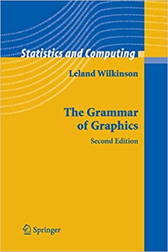
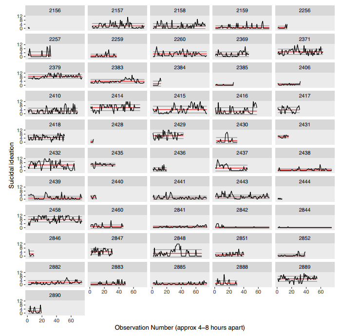

```{r setup, include=FALSE, purl=FALSE}
library(ggplot2)
library(gapminder)
library(dplyr)
library(patchwork)

options(htmltools.dir.version = FALSE)
knitr::opts_chunk$set(comment = "##",
                      cache = T,
                      fig.align = "center",
                      dev = "svg",
                      message = F,
                      warning = F)
```

```{css, echo=FALSE}
#data-visualization-with-span-style-font-family-monospace-ggplot2-span- {
  font-size: 45px;
}

.layer {
  min-width: 90%;
  min-height: 32px;
  line-height: 32px;
  margin: 10px auto;
  text-align: center;
  border-radius: 3px;
  font-weight: bold;
}

.badge {
  width: 75px;
  height: 75px;
  border-radius: 50%;
  margin: 30px 80px 0 auto;
  position: fixed;
  top:0;
  right:0; 
}

.badge2 {
  margin-right: 120px;
  opacity: .5;
}


.code-overflow .remark-code,
.code-overflow .r,
.code-overflow .hljs {
  max-height: 250px;
  overflow: auto;
}
```

.pull-left[
# `ggplot2()`
The `ggplot2` package is based on a philosophy outlined in [*The Grammar of Graphics*](https://www.springer.com/gp/book/9780387245447)

Understanding the philosophy is 90% of understanding how to create figures with `ggplot2`

The remaining 10% is learning the various functions that correspond with each part of the philosophy

This lecture is focused on understanding that philosophy, but we will also play around with some example code
]

.pull-right[
<div style="text-align:right">
  
  
</div>
]


---
# The Grammar of Graphics

**Central Idea**: Instead of creating a function for every single type of plot,<sup>1</sup> decompose graphics its its separate components/layers that can be used flexibly to create (almost) any type of plot you want

<div class="layer" style="background-color:#388d9b;">Data</div>
<div class="layer" style="background-color:#d13460;">Mapping</div>
<div class="layer" style="background-color:#ff9f37;">Geometries</div>
<div class="layer" style="background-color:#ffe789;">Statistics</div>
<div class="layer" style="background-color:#86b35d;">Scale</div>
<div class="layer" style="background-color:#299cd8;">Facets</div>
<div class="layer" style="background-color:#e65540;">Coordinates</div>
<div class="layer" style="background-color:#858988;">Theme</div>


.footnote[[1] New types of plots are being created nearly every day, so this would be impossible to accomplish]

---
# Example Data: `gapminder`


.smallish[
We will be using the `gapminder` data from the `gapminder` package for this lecture

```{r}
str(gapminder)
```

- `r length(unique(gapminder$country))` countries (`country`)
- `r length(unique(gapminder$continent))` continents (`continent`)
- `r length(unique(gapminder$year))` discrete years from `r min(gapminder$year)` to `r max(gapminder$year)` (`year`)
- life expectancy (`lifeExp`)
- population estimate (`pop`)
- GDP per capita (`gpsPercap`)

]
---
## Constructing a `ggplot`

.small[

`ggplot` figures are created started with the `ggplot()` function

```{r, eval=F}
ggplot(data = NULL, mapping = aes(), ..., environment = parent.frame())
```

- `data` defined within a call to `ggplot()` are defined globally, which means each layer will used these data for plotting by default
- `mapping` defined within a call to `ggplot()` are also defined globally for each layer to use by default

.pull-left[
```{r, fig.width=3, fig.height=2.5}
# A blank ggplot template
ggplot()
```
]

.pull-right[

The `+` sign is used to add layers
```{r, eval=F}
ggplot() +
  geom_layer() + 
  another_geom_layer() + 
  facet_layer() +
  theme_layer()
```

Layers are added on top of each other, so the order matters

Unlike base R plots, `ggplots` can be saved as objects
```{r, eval=F}
p <- ggplot() + ...
```
]
]
---
<div>
  <h1 style="inline">Data</h1>
  <div class="badge" style="background-color:#388d9b;"></div>
<div>

.smallish[
.pull-left[
- This layer refers to the data that go into your figure

- Can be one dataframe (defined globally) or many dataframes (defined at each layer)

- Creating graphics is mostly about getting your data cleaned and in the format you need

  - Most of the time your data will need to be in long (aka "tidy") format

  - Sometimes you will need to supply data of summary statistics (e.g., for `geom_errorbar()`), but most of the time you will control the summary statistics within the `statistics` layer
]

.pull-right[
```{r, fig.height=3, fig.width=4}
# Set global data as flights
# (from nycflights13 package)
ggplot(data = gapminder)
```

☝️ Because we do not have any geometry, the plot is still blank
]
]
---
<div>
  <h1 style="inline">Mapping</h1>
  <div class="badge" style="background-color:#d13460;"></div>
</div>

.small[
.pull-left[
Once you have your data, you need to inform the graphics function how those data fit into the plot you want to create

In other words, you need to tell the graphics which variable represents `x`, `y`, etc.

There are *tons* of different aesthetic specifications, which can be found in [this documentation](https://ggplot2.tidyverse.org/articles/ggplot2-specs.html). Some of the most common are:

- `x`, `y` (x and y axis)
- `color`, `fill`
- `shape`
- `linetype`

Mapping occurs inside a function called `aes()`, which stands for for **aes**thetics

```{r}
aes(x = my_x_var, y = my_y_var)
```
]

.pull-right[
```{r, fig.height=3, fig.width=4}
# Map the x-axis to `year`
# color to `continent`
ggplot(data = gapminder,
       mapping = aes(x = year, color = continent))
```

☝️ The plot is getting some shape, but still no data are plotted because we have not added a geometry layer
]
]
---
<div>
  <h1 style="inline">Mapping</h1>
  <div class="badge" style="background-color:#d13460;"></div>
</div>

.smallish[

Calls to `aes()` are *always* made within other `ggplot2` functions (i.e., they are attributes of a layer, not their own layer)

Most of the time mapping will take column names for your data that you want to map on to each aesthetic of a plot

However, `aes()` can also take expressions (i.e., R code) that determine the axes, color groups, etc.

For example:

```{r, eval=F}
ggplot(data = gapminder,
       mapping = aes(x = year,
                     y = gdpPercap * pop,
                     color = continent == "Asia"))
```

☝ From the `gapminder` data:

- map `year` onto the x-axis
- total GDP (`gdpPercap * pop`) on the y-axis
- different colors where `contintent` `==` and `!=` "Asia"

]

---
<div>
  <h1 style="inline">Mapping vs. Setting</h1>
  <div class="badge" style="background-color:#d13460;"></div>
</div>

.small[
Arguments inside `aes()` (color, size, shape, etc.) **map** aesthetics to the data such that the colors, sizes, shapes, etc. *depend* on the data

- Used to plot different colors, shapes, sizes, etc. based on groups/condition in your data

These same arguments placed outside `aes()` (e.g., within `geom_*()`) **set** aesthetics to the layer such that the colors *do not depend* on the data

- Used to change the colors, shapes, sizes, etc. of the entire plot/layer

.pull-left[

````{r, eval=F}
# Mapping (wrong)
ggplot(data = gapminder,
       mapping = aes(x = year,
                     y = lifeExp,
                     color = "red")) + #<<
  ...
```

```{r, echo=F, fig.height=2.5, fig.width=5}
ggplot(data = gapminder,
       mapping = aes(x = year,
                     y = lifeExp,
                     color = "red")) +
  geom_line(stat = "smooth")
```
]

.pull-right[
````{r, eval=F}
# Setting (right)
ggplot(data = gapminder,
       mapping = aes(x = year,
                     y = lifeExp)) + #<<
  ...(color = "red")
#
```

```{r, echo=F, fig.height=2.5, fig.width=5}
ggplot(data = gapminder,
       mapping = aes(x = year,
                     y = lifeExp)) +
  geom_line(stat = "smooth", color = "red")
```
]

]

---
<div>
  <h1 style="inline">Geometries</h1>
  <div class="badge" style="background-color:#ff9f37;"></div>
</div>

.smallish[
- Mostly what you think about in `ggplot2`
- Take all the **scale** values from come from mapping and may have been transformed by **statistics** and interprets/plots them in some way
  - e.g., a line geometry (`geom_line()`) interprets data on way and creates lines on your figure while a boxplot geometry (`geom_boxplot()`) interprets the data another way 
  
.pull-left[
```{r, fig.height=2.60, fig.width=4}
ggplot(data = gapminder,
       mapping = aes(x = year,
                     y = lifeExp)) +
  geom_line(stat = "summary") #<<
```
]

.pull-right[
```{r, fig.height=2.60, fig.width=4}
ggplot(data = gapminder,
       mapping = aes(x = year)) +
  # No `y` mapping needed for boxplot
  geom_boxplot() #<<
```
]
]
---
<div>
  <h1 style="inline">Geometries</h1>
  <div class="badge" style="background-color:#ff9f37;"></div>
</div>

.small[
- Geometries are intimately intertwined with **statistics**, and each `geom_*()` has a default statistic (`stat`) assigned
- The default statistic for `geom_line()` is [identity](https://ggplot2.tidyverse.org/reference/stat_identity.html), which means ("leave the data as is"). 

.pull-left[
If we create a line geometry with the data "as is" we get the following plot:
```{r, fig.height=2.60, fig.width=4}
ggplot(data = gapminder,
       mapping = aes(x = year,
                     y = lifeExp)) +
  geom_line() # stat = "identity"
```
☝ Plots every single point across every single year
]


.pull-right[
When we change the default to [summary](https://ggplot2.tidyverse.org/reference/stat_summary.html), we get a plots of mean values (changed with `fun`)
```{r, fig.height=2.60, fig.width=4}
ggplot(data = gapminder,
       mapping = aes(x = year,
                     y = lifeExp)) +
  geom_line(stat = "summary")
```
☝ Plots mean values for all observations within each year
]
]
---
<div>
  <h1 style="inline">Geometries</h1>
  <div class="badge" style="background-color:#ff9f37;"></div>
</div>

--


- Different geometries do not necessary share the same mapping. For example, `geom_point()` needs (at minimum) an `x` and `y` mapping, but `geom_histogram()` only needs an `x` mapping (the statistic determines the y-axis)
--


- There is an "Aesthetics" section in the help page for each `geom` that describes the required and optional mapping parameters

  - For example, `goem_linerange()` needs `x` *or* `y`, `ymin` *or* `xmin`, and `ymax` *or* `xmax` while `geom_histogram()` needs only `x` or `y`

******
--


## Multiple Geometries
--


- You can (and often will) have multiple layers of geometries in the same figure
--


- The order or your geometries matter, because each later is plotted on top of the previous layers

---
<div>
  <h1 style="inline">Geometries</h1>
  <div class="badge" style="background-color:#ff9f37;"></div>
</div>

## Add bar geometry

.smallish[

.pull-left[
```{r, eval=F}
ggplot(data = gapminder,
       mapping = aes(x = year,
                     y = lifeExp)) +
  geom_bar(stat = "summary", #<<
           width = 3, #<<
           fill = "red") #<<
```
]

.pull-right[
```{r, fig.height=3, fig.width=4, echo=F}
ggplot(data = gapminder,
       mapping = aes(x = year,
                     y = lifeExp)) +
  geom_bar(stat = "summary", width = 3, fill = "red")
```
]
]
---
<div>
  <h1 style="inline">Geometries</h1>
  <div class="badge" style="background-color:#ff9f37;"></div>
</div>

## Add line geometry

.smallish[

.pull-left[
```{r, eval=F}
ggplot(data = gapminder,
       mapping = aes(x = year,
                     y = lifeExp)) +
  geom_bar(stat = "summary",
           width = 3,
           fill = "red") +
  geom_line(stat = "summary", #<<
            color = "blue") #<<
```
]

.pull-right[
```{r, fig.height=3, fig.width=4, echo=F}
ggplot(data = gapminder,
       mapping = aes(x = year,
                     y = lifeExp)) +
  geom_bar(stat = "summary", width = 3, fill = "red") +
  geom_line(stat = "summary", color = "blue")
```
]
]
---
<div>
  <h1 style="inline">Geometries</h1>
  <div class="badge" style="background-color:#ff9f37;"></div>
</div>

## Add point geometry

.smallish[

.pull-left[
```{r, eval=F}
ggplot(data = gapminder,
       mapping = aes(x = year,
                     y = lifeExp)) +
  geom_bar(stat = "summary",
           width = 3,
           fill = "red") +
  geom_line(stat = "summary",
            color = "blue") +
  geom_point(stat = "summary", #<<
             color = "orange") #<<
```
]

.pull-right[
```{r, fig.height=3, fig.width=4, echo=F}
ggplot(data = gapminder,
       mapping = aes(x = year,
                     y = lifeExp)) +
  geom_bar(stat = "summary", width = 3, fill = "red") +
  geom_line(stat = "summary", color = "blue") +
  geom_point(stat = "summary", color = "orange")
```
]
]
---
<div>
  <h1 style="inline">Geometries</h1>
  <div class="badge" style="background-color:#ff9f37;"></div>
</div>

## Add area geometry

.smallish[
.pull-left[
```{r, eval=F}
ggplot(data = gapminder,
       mapping = aes(x = year,
                     y = lifeExp)) +
  geom_bar(stat = "summary",
           width = 3,
           fill = "red") +
  geom_line(stat = "summary",
            color = "blue") +
  geom_point(stat = "summary",
             color = "orange") +
  geom_area(stat = "summary", #<<
            alpha = .5, #<<
            fill = "blue") #<<
```
]

.pull-right[
```{r, fig.height=3, fig.width=4, echo=F}
ggplot(data = gapminder,
       mapping = aes(x = year,
                     y = lifeExp)) +
  geom_bar(stat = "summary", width = 3, fill = "red") +
  geom_line(stat = "summary", color = "blue") +
  geom_point(stat = "summary", color = "orange") +
  geom_area(stat = "summary", alpha = .5, fill = "blue")
```
]
]

---
<div>
  <h1 style="inline">Statistics</h1>
  <div class="badge" style="background-color:#ffe789;"></div>
</div>

.smallish[
- Your data do not always have the required statistics for each type of figure
  - For example, plotting a boxplot requires calculating the 25th, 50th, and 75th percentiles of your data and the interquartile range 
  - Sometimes your data are exactly what is needed (e.g., creating a scatterplot), in which case you set your statistic to **identity** which just passes your data on to that layer

- Provides convenience and flexibility because you do not need to know how your data need to be manipulated for each type of figure

- However, sometimes you do need to manipulate your data to get the correct aesthetic mapping for a geom (e.g., creating errobars)

.pull-left[
```{r, eval=F}
ggplot(data = gapminder,
       mapping = aes(x = year,
                     y = lifeExp)) +
  geom_bar(stat = "summary") + 
  geom_errorbar() #<<
```
]

.pull-right[
<pre style="background-color: rgb(193, 52, 52, .5); border: 2px solid rgb(193, 52, 52); padding-left: 10px; padding-top: 5px;">
Error: geom_errorbar
requires the following
missing aesthetics: ymin
and ymax or xmin and xmax
<pre>
]

]
---
<div>
  <h1 style="inline">Statistics: Errorbars</h1>
  <div class="badge" style="background-color:#ffe789;"></div>
</div>


.small[
**Step 1**: create summary statistics from our data (mean and standard error) :

```{r}
gp_summary <- gapminder %>%
  group_by(year) %>%
  summarize(mean_lifeExp = mean(lifeExp, na.rm = T),
            se_lifeExp = sd(lifeExp, na.rm = T) / sqrt(n()))
```

**Step 2**: Supply these data to the `geom_errorbar()` layer to control the height of the errorbars

```{r, fig.height=2.1, fig.width=6.5}
ggplot(data = gapminder, mapping = aes(x = year, y = lifeExp)) +
  geom_point(stat = "summary") +
  geom_errorbar(data = gp_summary, #<<
                mapping = aes(x = year, y = mean_lifeExp, #<<
                              ymin = mean_lifeExp - se_lifeExp, #<<
                              ymax = mean_lifeExp + se_lifeExp)) #<<
```
]
---
<div>
  <h1 style="inline">Statistics</h1>
  <div class="badge" style="background-color:#ffe789;"></div>
</div>

## Errorbar Types

.pull-left[
`geom_linerange()`

```{r,echo=F, fig.height=3}
ggplot(data = gapminder, mapping = aes(x = year, y = lifeExp)) +
  geom_linerange(data = gp_summary, #<<
                mapping = aes(x = year, y = mean_lifeExp, #<<
                              ymin = mean_lifeExp - se_lifeExp, #<<
                              ymax = mean_lifeExp + se_lifeExp)) #<<
```

`geom_pointrange()`

```{r,echo=F, fig.height=3}
ggplot(data = gapminder, mapping = aes(x = year, y = lifeExp)) +
  geom_pointrange(data = gp_summary, #<<
                mapping = aes(x = year, y = mean_lifeExp, #<<
                              ymin = mean_lifeExp - se_lifeExp, #<<
                              ymax = mean_lifeExp + se_lifeExp),
                fill = "white", color = "black", shape = 21) #<<
```
]

.pull-right[
`geom_crossbar()`

```{r,echo=F, fig.height=3}
ggplot(data = gapminder, mapping = aes(x = year, y = lifeExp)) +
  geom_crossbar(data = gp_summary, #<<
                mapping = aes(x = year, y = mean_lifeExp, #<<
                              ymin = mean_lifeExp - se_lifeExp, #<<
                              ymax = mean_lifeExp + se_lifeExp)) #<<
```

`geom_errorbar()`

```{r,echo=F, fig.height=3}
ggplot(data = gapminder, mapping = aes(x = year, y = lifeExp)) +
  geom_errorbar(data = gp_summary, #<<
                mapping = aes(x = year, y = mean_lifeExp, #<<
                              ymin = mean_lifeExp - se_lifeExp, #<<
                              ymax = mean_lifeExp + se_lifeExp)) #<<
```
]
---
<div>
  <h1 style="inline">Statistics</h1>
  <div class="badge" style="background-color:#ffe789;"></div>
</div>

Statistics are linked to geometries such that each geometry requires a statistic (and vice versa: each statistic requires a geometry)

Thus, geometries have default statistics that try to guess what you want to plot but that can also be changed

Defaults for common geometries:

.smallish[
.pull-left[
- `geom_point(stat = "identity"`

- `geom_count(stat = "sum")`

- `geom_jitter(stat = "identity")`

- `geom_bar(stat = "count")`

- `geom_density(stat = "density")`

- `geom_histrogram(stat = "bin")`
]

.pull-right[
- `geom_boxplot(stat = "boxplot")`

- `geom_violin(stat = "ydensity")`

- `geom_rug(stat = "identity")`

- `geom_freqpoly(stat = "bin")`

- `geom_quantile(stat = "quantile")`

- `geom_smooth(stat = "smooth")`
]
]
---
<div>
  <h1 style="inline">Statistics</h1>
  <div class="badge" style="background-color:#ffe789;"></div>
</div>

.smallish[

Geometries can be created using `geom_*()` and passing in the statistic as an argument (as we have seen) *or* using `stat_*()` and passing the geometry in as an argument

There's no one right way to do this, although it is most common to create the geometry with `geom_*()` rather than `stat_*()`


.pull-left[
**`geom_*()`**
```{r, fig.height=4}
ggplot(data = gapminder,
       mapping = aes(x = year,
                     y = lifeExp)) +
  geom_bar(stat = "summary") 
```
]

.pull-right[
**`stat_*()`**
```{r, fig.height=4}
ggplot(data = gapminder,
       mapping = aes(x = year,
                     y = lifeExp)) +
  stat_summary(geom = "bar")
```
]
]
---
<div>
  <h1 style="inline">Mapping</h1>
  <div class="badge" style="background-color:#d13460;"></div>
</div>

.smallish[
Now that we know how to create geometry and statistics layers we can understand aesthetic mapping more completely
]

.small[
.pull-left[
**No color mapping**
```{r, fig.height=4}
ggplot(data = gapminder,
       mapping = aes(x = year,
                     y = lifeExp)) + 
  # No color mapping
  geom_line(stat = "summary")

```
]

.pull-right[
**Color mapped to continent**
```{r, fig.height=4}
ggplot(data = gapminder,
       mapping = aes(x = year,
                     y = lifeExp,
                     color = continent)) + #<< 
  geom_line(stat = "summary")
```
]
]
---
<div>
  <h1 style="inline">Mapping</h1>
  <div class="badge" style="background-color:#d13460;"></div>
</div>

.small[

You can map the same (or different) columns to multiple aesthetics within one call to `aes()`

.pull-left[
```{r, fig.height=4}
ggplot(data = gapminder,
       mapping = aes(x = year,
                     y = lifeExp,
                     color = continent,
                     linetype = continent)) +
  # Size equal among groups
  geom_line(stat = "summary")
```
]

.pull-right[
```{r, fig.height=4}
ggplot(data = gapminder,
       mapping = aes(x = year,
                     y = lifeExp,
                     color = continent, 
                     linetype = continent,
                     size = ave(pop, continent))) +
  geom_line(stat = "summary")
```
]
]
---
<div>
  <h1 style="inline">Mapping: Layer-level </h1>
  <div class="badge" style="background-color:#d13460;"></div>
</div>

**Line geometry for each country, color by continent**

.smallish[

```{r, eval=F}
ggplot(data = gapminder,
       mapping = aes(x = year, y = lifeExp, color = continent)) +
  geom_line(mapping = aes(group = country),
            stat = "summary",
            alpha = .5)
# 
# 
```

```{r, fig.height=2.75, fig.width=8, echo=F}
ggplot(data = gapminder,
       mapping = aes(x = year, y = lifeExp)) +
  geom_line(mapping = aes(group = country, color = continent),
            stat = "summary",
            alpha = .5)
```
]
---
<div>
  <h1 style="inline">Mapping: Layer-level </h1>
  <div class="badge" style="background-color:#d13460;"></div>
</div>

**Line geometry for each continent, color by continent**

.smallish[
```{r, fig.height=2.75, fig.width=8}
ggplot(data = gapminder,
       mapping = aes(x = year, y = lifeExp, color = continent)) +
  geom_line(mapping = aes(group = country),
            stat = "summary",
            alpha = .5) +
  geom_line(stat = "summary",
            size = 3)
```
]

---
<div>
  <h1 style="inline">Scales</h1>
  <div class="badge" style="background-color:#86b35d;"></div>
</div>

.small[
**How are properties of the axes, colors, and other aethetics determined? Scales!**

**Scales** control the details of how data values are translated to visual properties (e.g., 
plot Africa with #F8766D, Americas with #B79F00, etc.)

All geometries are given default scales which you can override with the `scale_*()` function

To get the scales for each layer of your ggplot figure, use `build_ggplot()`

```{r}
p <- ggplot(data = gapminder,
       mapping = aes(x = year, y = lifeExp, color = continent)) + 
  geom_line(stat = "summary")

ggplot_build(p)$data[[1]] %>% #<<
  str()
```
]

---
<div>
  <h1 style="inline">Scales</h1>
  <div class="badge" style="background-color:#86b35d;"></div>
</div>

.small[

Scale functions have the syntax: `scale_<aesthetic>_<type>` where `<aesthetic>` refers to each aesthetic mapping (`x`, `y`, `color`, etc.) and `<type>` refers to the type of scale (continuous, discrete, log10, etc.)

**Axes scales**

- `scale_x_continous()`, `scale_y_continuous()` (transform with `trans` argument)
- `scale_x_log10()`, `scale_y_log10()`
- `scale_x_sqrt()`, `scale_y_sqrt()`
- `scale_x_reverse()`, `scale_y_reverse()`
- `scale_x_discrete()`, `scale_y_discrete()`
- `scale_x_binned()`, `scale_y_binned()`

**Color, shape, size scales**
- `scale_color_continuous()`, `scale_shape_continuous()`, `scale_size_continuous()`
- `scale_color_discrete()`, `scale_shape_discrete()`, `scale_size_discrete()`
- `scale_color_binned()`, `scale_shape_binned()`, `scale_size_binned()`
- `scale_color_brewer()`, `scale_shape_brewer()`, `scale_size_brewer()`

<div style="height:20px;"></div>

There are dozens of different types of scales in `ggplot2`, all of which can be found in [this documentation](https://ggplot2.tidyverse.org/reference/#section-scales).

Also check out the [scales](https://cran.r-project.org/web/packages/scales/scales.pdf) package

]

---
<div>
  <h1 style="inline">Scales: Example</h1>
  <div class="badge" style="background-color:#86b35d;"></div>
</div>

.small[

```{r, echo=F}
p <- ggplot(data = gapminder,
            mapping = aes(x = year,
                          y = gdpPercap * pop,
                          color = continent)) + 
  geom_line(stat = "summary", size = 1.5, alpha = .8) +
  geom_point(stat = "summary", shape = 21, fill = "white", size = 2)
```

```{r, eval=F}
ggplot(data = gapminder,
       mapping = aes(x = year,
                     y = gdpPercap * pop,
                     color = continent)) + 
  geom_line(stat = "summary", size = 1.5) +
  geom_point(stat = "summary", shape = 21, fill = "white", size = 2)
  # 
  # 
  # 
  # 
  # 
```


```{r, echo=F, fig.height=2.75}
p
```
]
---
<div>
  <h1 style="inline">Scales: Example</h1>
  <div class="badge" style="background-color:#86b35d;"></div>
</div>

.small[
```{r, eval=F}
ggplot(data = gapminder,
       mapping = aes(x = year,
                     y = gdpPercap * pop,
                     color = continent)) + 
  geom_line(stat = "summary", size = 1.5) +
  geom_point(stat = "summary", shape = 21, fill = "white", size = 2) +
  scale_x_continuous(name = "Year",
                     breaks = unique(gapminder$year))
  # 
  # 
  # 
```

```{r, echo=F, fig.height=2.75}
p +
  scale_x_continuous(name = "Year",
                     breaks = unique(gapminder$year))
```
]


---
<div>
  <h1 style="inline">Scales: Example</h1>
  <div class="badge" style="background-color:#86b35d;"></div>
</div>

.small[
```{r, eval=F}
ggplot(data = gapminder,
       mapping = aes(x = year,
                     y = gdpPercap * pop,
                     color = continent)) + 
  geom_line(stat = "summary", size = 1.5) +
  geom_point(stat = "summary", shape = 21, fill = "white", size = 2) +
  scale_x_continuous(name = "Year",
                     breaks = unique(gapminder$year)) +
  scale_y_continuous(name = "Gross Domestic Product (USD)")
  # 
  # 
```

```{r, echo=F, fig.height=2.75}
p +
  scale_x_continuous(name = "Year",
                     breaks = unique(gapminder$year)) +
  scale_y_continuous(name = "Gross Domestic Product (USD)")
```
]
---
<div>
  <h1 style="inline">Scales: Example</h1>
  <div class="badge" style="background-color:#86b35d;"></div>
</div>

.small[
```{r, eval=F}
ggplot(data = gapminder,
       mapping = aes(x = year,
                     y = gdpPercap * pop,
                     color = continent)) + 
  geom_line(stat = "summary", size = 1.5) +
  geom_point(stat = "summary", shape = 21, fill = "white", size = 2) +
  scale_x_continuous(name = "Year",
                     breaks = unique(gapminder$year)) +
  scale_y_continuous(name = "Gross Domestic Product (USD)") + 
  scale_color_brewer(palette = "Set1")
  # 
```

```{r, echo=F, fig.height=2.75}
p +
  scale_x_continuous(name = "Year",
                     breaks = unique(gapminder$year)) +
  scale_y_continuous(name = "Gross Domestic Product (USD)") + 
  scale_color_brewer(palette = "Set1")
```
]
---
<div>
  <h1 style="inline">Scales: Example</h1>
  <div class="badge" style="background-color:#86b35d;"></div>
</div>

.small[

```{r, eval=F}
ggplot(data = gapminder,
       mapping = aes(x = year,
                     y = gdpPercap * pop,
                     color = continent)) + 
  geom_line(stat = "summary", size = 1.5) +
  geom_point(stat = "summary", shape = 21, fill = "white", size = 2) +
  scale_x_continuous(name = "Year",
                     breaks = unique(gapminder$year)) +
  scale_y_continuous(name = "Gross Domestic Product (USD)") + 
  scale_color_brewer(palette = "Set1") + 
  ggtitle("Life Expectancy Over Time by Continent")
```


```{r, echo=F, fig.height=2.75}
p +
  scale_x_continuous(name = "Year",
                     breaks = unique(gapminder$year)) +
  scale_y_continuous(name = "Gross Domestic Product (USD)") +
  scale_color_brewer(palette = "Set1") + 
  ggtitle(label = "GDP Over Time by Continent")
```
]
---
<div>
  <h1 style="inline">Scales: Continuous Color</h1>
  <div class="badge" style="background-color:#86b35d;"></div>
</div>

.small[
```{r, fig.height=3.4}
ggplot(data = gapminder,
       mapping = aes(x = year,
                     y = lifeExp,
                     group = continent,
                     size = ave(pop, continent),
                     color = ave(gdpPercap, continent))) +
  geom_point(stat = "summary") +
  scale_color_continuous(name = "GDP Per Capita") +
  scale_size_continuous(name = "Avg. Population")
```
]
---
<div>
  <h1 style="inline">Facets</h1>
  <div class="badge" style="background-color:#299cd8;"></div>
</div>

.smallish[

.pull-left[
- Often we are focused on creating one figure per plotting area, but we are not constrained to this and may want to create multiple subplots when looking at our data

- [**Facets**](https://ggplot2-book.org/facet.html) are multiple panels of plots, with the same plotting logic, on different groups of your data

- Facets are most helpful when you are investigating your data, but they may help you create figures for publication as in [Kleiman et al. (2017)](https://doi.org/10.1037/abn0000273)

- Use facets to prevent overplotting (plotting too much data in one figure)
]

.pull-right[

]

- Two different kinds of facets: `facet_wrap()` and `facet_grid()`

- Because facets are extendable, there are packages (e.g., [ggh4x](https://teunbrand.github.io/ggh4x/articles/Facets.html)) with additional types of facets

]
---
<div>
  <h1 style="inline">Facets:<code class="remark-inline-code">facet_wrap()</code></h1>
  <div class="badge" style="background-color:#299cd8;"></div>
</div>

.smallish[
`facet_wrap()` takes a column from your data with a grouping structure and creates several subplots for each group (`facet_wrap(~ groupvar)`)

```{r, fig.height=3.5, fig.width=9}
ggplot(data = gapminder,
       mapping = aes(x = year,
                     y = lifeExp)) +
  geom_line(mapping = aes(group = country), stat = "summary", size = .25) +
  geom_line(stat = "summary", size = 2, alpha = .5, color = "blue") +
  facet_wrap(~ continent) #<<
```
]
---
<div>
  <h1 style="inline">Facets:<code class="remark-inline-code">facet_grid()</code></h1>
  <div class="badge" style="background-color:#299cd8;"></div>
</div>

.smallish[

`facet_grid()` takes two grouping variables and creates plots that show the intersection between them (`facet_grid(group1 ~ group2)`)

```{r, echo=F}
gapminder <- gapminder %>%
  group_by(continent) %>%
  mutate(gdprelative = if_else(gdpPercap > mean(gdpPercap), "Large GDP Per Capita", "Small GDP Per Capita"))
```

```{r, fig.height=3.5, fig.width=9}
ggplot(data = gapminder,
       mapping = aes(x = year,
                     y = lifeExp)) +
  geom_line(mapping = aes(group = country), stat = "summary", size = .25) +
  geom_line(stat = "summary", size = 2, alpha = .5, color = "blue") +
  facet_grid(continent ~ gdprelative) # GDP larger/smaller to continent mean #<<
```

]
---
<div>
  <h1 style="inline">Facets:<code class="remark-inline-code">facet_grid()</code></h1>
  <div class="badge" style="background-color:#299cd8;"></div>
</div>

.smallish[

`facet_grid()` can also be arranged with *n<sub>groups</sub>* panels with `~ group1 + group2`

```{r, echo=F}
gapminder <- gapminder %>%
  group_by(continent) %>%
  mutate(gdprelative = if_else(gdpPercap > mean(gdpPercap), "Large GDP", "Small GDP"))
```

```{r, fig.height=3.5, fig.width=9}
ggplot(data = gapminder,
       mapping = aes(x = year,
                     y = lifeExp)) +
  geom_line(mapping = aes(group = country), stat = "summary", size = .25) +
  geom_line(stat = "summary", size = 2, alpha = .5, color = "blue") +
  facet_grid(~ continent + gdprelative)  #<<
```

]


---
<div>
  <h1 style="inline">Facets + Scales</h1>
  <div class="badge" style="background-color:#299cd8;"></div>
  <div class="badge badge2" style="background-color:#86b35d;"></div>
</div>

.smallish[
- By default, facets fix the `x` and `y` scales across all plots
- Often this makes sense, because you want to compare the same data across different groups, but sometimes you may want to free either/both of the axis scales. You can do this with the `scales` argument (`"free"`, `"free_x"`, `"free_y"`)

```{r, eval=F}
ggplot(...) +
  facet_grid(continent ~ gdprelative,
             scales = "free") 
```


```{r, fig.height=3.5, fig.width=9, echo=F}
ggplot(data = gapminder,
       mapping = aes(x = year,
                     y = lifeExp)) +
  geom_line(mapping = aes(group = country), stat = "summary", size = .25) +
  geom_line(stat = "summary", size = 2, alpha = .5, color = "blue") +
  facet_grid(continent ~ gdprelative, scales = "free_y") 
```
]
---
<div>
  <h1 style="inline">Coordinates</h1>
  <div class="badge" style="background-color:#e65540;"></div>
</div>

The **coordinate** system represents a physical mapping of the plot's aesthetics onto the screen

Many types of coordinate systems, but we are most used to the Cartesian system (`x`, `y` value pairs)

Types of coordinate systems in ggplot2:
--


- `coord_cartesian()`: Cartesian coordinates
--


- `coord_trans()`: Transformed Cartesian coordinate system
--


- `coord_fixed()`: Cartesian coordinates with a fixed aspect ratio
--


- `coord_flip()`: Cartesian coordinates with `x` and `y` flipped
--


- `coord_polar()` polar coordinates
--


- `coord_map()`, `coord_quickmap()`: map projections (latitude, longitude)
---
<div>
  <h2 style="inline">Coordinates:<code class="remark-inline-code">coord_flip()</code></h2>
  <div class="badge" style="background-color:#e65540;"></div>
</div>

.small[

.pull-left[

```{r, eval=F}
ggplot(data = gapminder,
       mapping = aes(x = continent,
                     y = gdpPercap)) +
  geom_bar(stat = "summary")
  # 
```

```{r, echo=F}
ggplot(data = gapminder,
       mapping = aes(x = continent,
                     y = gdpPercap)) +
  geom_bar(stat = "summary")
```

]


.pull-right[
```{r}
ggplot(data = gapminder,
       mapping = aes(x = continent,
                     y = gdpPercap)) +
  geom_bar(stat = "summary") +
  coord_flip()
```
]
]
---
<div>
  <h2 style="inline">Coordinates:<code class="remark-inline-code">coord_polar()</code></h2>
  <div class="badge" style="background-color:#e65540;"></div>
</div>

.small[

`coord_polar()` interprets `x` and `y` as the radius and angle, respecitvely

.pull-left[
**Bar Chart**
```{r, eval=F}
ggplot(data = gapminder,
       mapping = aes(x = year,
                     y = gdpPercap,
                     fill = continent)) +
  geom_bar(stat = "summary", color = "black")
  # 
```

```{r, fig.height=5, echo=F}
ggplot(data = gapminder,
       mapping = aes(x = year,
                     y = gdpPercap,
                     fill = continent)) +
  geom_bar(stat = "summary", color = "black")
```
]

.pull-right[

**Coxcomb Plot**
```{r, fig.height=5}
ggplot(data = gapminder,
       mapping = aes(x = year,
                     y = gdpPercap,
                     fill = continent)) +
  geom_bar(stat = "summary", width = 5, color = "black") +
  coord_polar() #<<
```
]
]
---
<div>
  <h2 style="inline">Coordinates:<code class="remark-inline-code">coord_polar()</code></h2>
  <div class="badge" style="background-color:#e65540;"></div>
</div>

## Pie Chart

.small[

.pull-left[
```{r, eval=F}
ggplot(data = gapminder,
       mapping = aes(x = "", y = pop, fill = continent)) +
  geom_bar(stat = "summary") +
  # 
```

```{r, fig.height=6, echo=F}
ggplot(data = gapminder,
       mapping = aes(x = "", y = pop, fill = continent)) +
  geom_bar(stat = "summary")
```
]

.pull-right[
```{r, fig.height=6}
ggplot(data = gapminder,
       mapping = aes(x = "", y = pop, fill = continent)) +
  geom_bar(stat = "summary") + 
  coord_polar(theta = "y") # map angle to y
```
]
]
---
<div>
  <h2 style="inline">Coordinates:<code class="remark-inline-code">coord_map()</code></h2>
  <div class="badge" style="background-color:#e65540;"></div>
</div>

.small[

.pull-left[
**Cartesian System**
```{r, eval=F}
ggplot(data = map_data("world"),
       mapping = aes(x = long,
                     y = lat,
                     group = group)) +
  geom_path() +
  scale_y_continuous(breaks = (-2:2) * 30) +
  scale_x_continuous(breaks = (-4:4) * 45)
  # 
  # 
```

```{r, fig.height=5, echo=F}
ggplot(data = map_data("world"),
       mapping = aes(x = long,
                     y = lat,
                     group = group)) +
  geom_path() +
  scale_y_continuous(breaks = (-2:2) * 30) +
  scale_x_continuous(breaks = (-4:4) * 45)
```
]

.pull-right[

**Azimuthal (orthographic) Projection**
```{r, fig.height=5}
ggplot(data = map_data("world"),
       mapping = aes(x = long,
                     y = lat, 
                     group = group)) +
  geom_path() +
  scale_y_continuous(breaks = (-2:2) * 30) +
  scale_x_continuous(breaks = (-4:4) * 45) +
  coord_map(projection = "ortho",
            orientation = c(30, -94, 0))
```
]
]
---
<div>
  <h1 style="inline">Scales vs. Coordinates</h1>
  <div class="badge" style="background-color:#e65540;"></div>
  <div class="badge badge2" style="background-color:#86b35d;"></div>
</div>

```{r, echo=F}
base <- ggplot(data = gapminder,
               mapping = aes(x = year,
                             y = gdpPercap * pop,
                             color = continent)) +
  geom_line(stat = "summary", size = 1.25) +
  scale_y_continuous(name = "GDP") +
  theme(legend.position = "top")
```

.smallish[

.pull-left[
**Scales**

1. Transform data
2. Estimate statistic

```{r, eval=F}
# log10(GDP) %>% mean()
ggplot(...) +
  scale_y_log10(name = "GDP")
```

```{r, fig.height=6, echo=F}
base +
  scale_y_log10(name = "GDP")
```
]

.pull-right[
**Coordinates**

1. Estimate statistic
2. Transform data

```{r, eval=F}
# mean(GDP) %>% log10
ggplot(...) +
  coord_trans(y = "log10")
```

```{r, fig.height=6, echo=F}
base +
  coord_trans(y = "log10")
```

]
]
---
<div>
  <h1 style="inline">Scales vs. Coordinates</h1>
  <div class="badge" style="background-color:#e65540;"></div>
  <div class="badge badge2" style="background-color:#86b35d;"></div>
</div>

.small[

You can use both **scales** and **coordinates** together to estimate your model on the transformed data and transform is back for interpretation

```{r, echo = F, fig.height = 4.25, fig.width=8}
base <- ggplot(data = gapminder,
               mapping = aes(x = year,
                             y = gdpPercap * pop)) +
  geom_smooth(method = "lm", se = F)
  
p1 <- base +
  scale_y_log10()

p2 <- base + 
  coord_trans(y = "log10")

p3 <- base + 
  scale_y_log10() +
  coord_trans(y = scales::exp_trans(10))

(base + p1) / (p2 + p3) +
  plot_layout(guides = "collect") + 
  plot_annotation(tag_levels = "A") &
  theme(axis.title.y = element_blank(),
        legend.position = "top")
  
```

.footnote[**(A)** Linear model on original data - does not fit well; **(B)** linear model on log10 transformed GDP - fits well; **(C)** Linear model on original data, then log10 transform y-axis (not in original scale); **(D)** log10 transform GDP, estimate model, backtransform axes to get original scale]
]
---
<div>
  <h2 style="inline">Theme</h2>
  <div class="badge" style="background-color:#858988;"></div>
</div>

The **theme** encompasses every part of the graphic that is not part of the data (i.e., has no mapping to the data)

There are several [pre-made themes](https://ggplot2.tidyverse.org/reference/ggtheme.html) that come with ggplot2:

.pull-left[
- `theme_grey()` 👈 default

- `theme_bw()`

- `theme_linedraw()`

- `theme_light()`

- `theme_dark()`
]

.pull-right[
- `theme_minimal()`

- `theme_classic()`

- `theme_void()`

- `theme_test()`
]

---

<div>
  <h2 style="inline">Theme</h2>
  <div class="badge" style="background-color:#858988;"></div>
</div>

To tweak other aspects of your plots them you can use the `theme()` function, which has 94 arguments to give you complete control over all elements of your plot

To demonstrate, we'll use the following base plot from Slide 32:

```{r, echo=F, fig.width=8, fig.height=3.75}
p <- ggplot(data = gapminder,
       mapping = aes(x = year,
                     y = gdpPercap * pop,
                     color = continent)) + 
  geom_line(stat = "summary", size = 1.5) +
  geom_point(stat = "summary", shape = 21, fill = "white", size = 2) +
  scale_x_continuous(name = "Year",
                     breaks = unique(gapminder$year)) +
  scale_y_continuous(name = "Gross Domestic Product (USD)") + 
  scale_color_brewer(palette = "Set1") + 
  coord_cartesian(ylim = c(0, 8e+11)) +
  ggtitle("Life Expectancy Over Time by Continent")

p
```

---

<div>
  <h2 style="inline">Theme: <code class="remark-inline-code">panel</code></h2>
  <div class="badge" style="background-color:#858988;"></div>
</div>

.small[

```{r, fig.height=3.75, fig.width=8}
p +
  theme(panel.grid.major = element_line(color = "black", linetype = 2, size = 0.25),
        panel.grid.minor = element_blank(),
        panel.background = element_rect(fill = "white"),
        panel.border = element_rect(color = "black", fill = NA, size = 1))
```

```{r, echo = F}
p <- p +
  theme(
    panel.grid.major = element_line(color = "grey", linetype = 2, size = 0.5),
    panel.grid.minor = element_blank(),
    panel.background = element_rect(fill = "white"),
    panel.border = element_rect(color = "black", fill = NA, size = 1)
  )
```
]

---
<div>
  <h2 style="inline">Theme: <code class="remark-inline-code">axes</code></h2>
  <div class="badge" style="background-color:#858988;"></div>
</div>

.small[
```{r, fig.height=3.75, fig.width=8}
p +
  theme(title = element_text(family = "Ubuntu Mono", face = "bold"),
        axis.title.y = element_text(family = "Ubuntu Mono"),
        axis.title.x = element_blank(),
        axis.text = element_text(family = "Ubuntu Mono", color = "black", size = 11),
        axis.text.x = element_text(angle = 45, hjust = 1))
```

```{r, echo = F}
p <- p +
  theme(title = element_text(family = "Ubuntu Mono", face = "bold"),
        axis.title.y = element_text(family = "Ubuntu Mono"),
        axis.title.x = element_blank(),
        axis.text = element_text(family = "Ubuntu Mono", color = "black", size = 11),
        axis.text.x = element_text(angle = 45, hjust = 1))
```
]

---

<div>
  <h2 style="inline">Theme: <code class="remark-inline-code">legend</code></h2>
  <div class="badge" style="background-color:#858988;"></div>
</div>

.small[

```{r, fig.height=3.75, fig.width=8}
p +
  theme(legend.key = element_blank(),
        legend.text = element_text(family = "Ubuntu Mono")) + 
  guides(color = guide_legend(title = "Continent"))
```

```{r, echo = F}
p <- p +
  theme(legend.key = element_blank(),
        legend.title = element_text(family = "Ubuntu Mono"),
        legend.text = element_text(family = "Ubuntu Mono")) + 
  guides(color = guide_legend(title = "Continent"))
```
]

---
<div>
  <h2 style="inline">Theme</h2>
  <div class="badge" style="background-color:#858988;"></div>
</div>

.small[
Just like `ggplot2` comes with pre-made themes, you can create your own themes to use repeatedly throughout your data visualizations

```{r, echo=F}
p <- ggplot(data = gapminder,
       mapping = aes(x = year,
                     y = gdpPercap * pop,
                     color = continent)) + 
  geom_line(stat = "summary", size = 1.5) +
  geom_point(stat = "summary", shape = 21, fill = "white", size = 2) +
  scale_x_continuous(name = "Year",
                     breaks = unique(gapminder$year)) +
  scale_y_continuous(name = "Gross Domestic Product (USD)") + 
  scale_color_brewer(palette = "Set1") + 
  coord_cartesian(ylim = c(0, 8e+11)) +
  ggtitle("Life Expectancy Over Time by Continent")
```

.pull-left[
```{r}
theme_monotype <- theme(
  # Grid theme
  panel.grid.major = element_line(color = "grey", linetype = 2, size = 0.5),
  panel.grid.minor = element_blank(),
  panel.background = element_rect(fill = "white"),
  panel.border = element_rect(color = "black", fill = NA, size = 1),

  # Axis theme
  title = element_text(family = "Ubuntu Mono", face = "bold"),
  axis.title.y = element_text(family = "Ubuntu Mono"),
  axis.title.x = element_blank(),       
  axis.text = element_text(family = "Ubuntu Mono", color = "black", size = 11),
  axis.text.x = element_text(angle = 45, hjust = 1),
  
  # Legend theme
  legend.key = element_blank(),
  legend.title = element_text(family = "Ubuntu Mono"),
  legend.text = element_text(family = "Ubuntu Mono")
)


```
]

.pull-right[
```{r}
p +
  theme_monotype
```
]
]

---
class: inverse
# patchwork

<div style="text-align:center; margin-top: 125px;">
  
</div>

---
# What is patchwork?

.small[
Patchwork is a package created by [Thomas Lin Pedersen](https://twitter.com/thomasp85) (also the maintainer of `ggplot2`) to help you easily and flexibly combine several ggplots into the same graphic

Consider the following four plots (`p1`, `p2`, `p3`, `p4`):

```{r, echo=F}
p1 <- ggplot(gapminder) +
  geom_point(aes(x = gdpPercap, y = lifeExp), alpha = .25) +
  ggtitle("p1")

p2 <- ggplot(gapminder) + 
  geom_bar(aes(x = year, y = pop), stat = "summary") +
  ggtitle("p2")

p3 <- ggplot(gapminder) + 
  geom_smooth(aes(x = year, y = lifeExp)) +
  ggtitle("p3")

p4 <- ggplot(gapminder) +
  geom_boxplot(aes(x = continent, y = lifeExp)) +
  ggtitle("p4")
```

```{r, echo=F, fig.height=4.25}
(p1 + p2) / (p3 + p4) & theme_bw() & theme(plot.title = element_text(family = "Ubuntu Mono"))
```
]
---
# Patchwork arithmetic

.small[
Patchwork uses arithmetic (`+`, `-`, `*`, `/`) and logical (`|`, `&`) operators to control the layout of your figure

```{r, eval=F}
(p1)
```

```{r, fig.height=4.25, echo=F}
p1 + theme(plot.title = element_blank())
```
]
---

# Patchwork arithmetic

.small[

**Add `p2`**

```{r, eval=F}
(p1 + p2)
```

```{r, fig.height=4.25, echo=F}
p1 + p2 & theme(plot.title = element_blank())
```
]

---

# Patchwork arithmetic

.small[

**Add `p3`**

```{r, eval=F}
(p1 + p2 + p3)
```

```{r, fig.height=4.25, echo=F}
p1 + p2 + p3 & theme(plot.title = element_blank())
```
]

---
# Patchwork arithmetic

.small[

**Add `p4`**

```{r, eval=F}
(p1 + p2 + p3) / p4
```

```{r, fig.height=4.25, echo=F}
(p1 + p2 + p3) / p4 & theme(plot.title = element_blank())
```
]
---
# `plot_layout()`

.small[

You can also use `plot_layout()` to control the layout of your plots

The `-` sign ensures that all the patchwork on the LHS (`p1 + p2 + p3`) and on the RHS (`p4`) are grouped (i.e., nested) together

```{r, eval=F}
p1 + p2 + p3 - p4 + plot_layout(nrow = 2)
```

```{r, fig.height=4, echo=F}
p1 + p2 + p3 - p4 + plot_layout(nrow = 2) & theme(plot.title = element_blank())
```
]

---

# `plot_layout()`

.small[

Use `plot_layout()` to control the heights and widths of your patchwork elements

```{r, eval=F}
(p1 + p2 + p3) / p4 + plot_layout(heights = c(1, 2))
```

```{r, fig.height=4, echo=F}
(p1 + p2 + p3) / p4 + plot_layout(heights = c(1, 3)) & theme(plot.title = element_blank())
```
]
---
## Combine multiple patchworks

.small[

To keep your code organized in a complex patchwork, you can save individual patchworks and combine them at the end

```{r, eval=F}
patchwork1 <- (p1 + p3 + coord_polar() + p2) + plot_layout(widths = c(1, 1, 4))
patchwork2 <- (p3 + p4) + plot_layout(widths = c(3, 1))

patchwork1 / patchwork2 + plot_layout(height = c(1, 4))
```

```{r, fig.height=3, echo=F}
patchwork1 <- (p1 + p3 + coord_polar() + p2) + plot_layout(widths = c(1, 1, 4))
patchwork2 <- (p3 + p4) + plot_layout(widths = c(3, 1))

patchwork1 / patchwork2 + plot_layout(height = c(1, 4)) & theme(plot.title = element_blank())

```
]
---
# Add layers to all ggplots 

.small[

With `patchwork`, you can control the layers (e.g., geoms, theme) of your ggplots all at once using the `&` operator. This is useful, for example, when you have several plots with the same theme or want to add a layer to every plot without adding this code to each and every plot

```{r, fig.height=3}
(p1 + p2 + p3) / p4 &
  scale_y_continuous(trans = "log10") &
  theme(plot.title = element_blank(),
        axis.text.x = element_text(angle = 45, hjust = 1),
        panel.grid = element_blank(),
        panel.background = element_rect(color = "darkblue",
                                        fill = "lightblue"))

```
]
---
# Add layers to some ggplots 

.small[

While the `&` operator adds layers to all ggplots in a patchwork, the `*` operator adds layers only to the current nesting level

```{r, fig.height=3}
(p1 + p2 + p3) *
  scale_y_continuous(trans = "log10") *
  theme(plot.title = element_blank(),
        axis.text.x = element_text(angle = 45, hjust = 1),
        panel.grid = element_blank(),
        panel.background = element_rect(color = "darkblue",
                                        fill = "lightblue")) / p4
```
]
---
# Controlling Legends

.small[

Imagine you have the following three plots configured using patchwork (`(p1 + p2) / p3`). The legends are identical and it is only necessary to have one of them for the entire figure.


```{r, fig.height=3.75, fig.wiwdth = 8, echo = F}
p1 <- ggplot(gapminder) +
  geom_line(aes(x = year, y = pop, color = continent),
            stat = "summary")

p2 <- ggplot(gapminder) +
  geom_line(aes(x = year, y = lifeExp, color = continent),
            stat = "summary")

p3 <- ggplot(gapminder) +
  geom_line(aes(x = year, y = gdpPercap, color = continent),
            stat = "summary")


(p1 + p2) / p3
```

]
---
# Controlling Legends

.small[

Combine identical legends with `guides = "collect"`

```{r, fig.height=4}
(p1 + p2) / p3 +
  plot_layout(guides = "collect")
```
]
---
# Titles & Tags

.small[
When you have a multi-plot figure such as that in the previous slide, it is common to label each plot to refer to in your manuscript. To apply titles and tags to the entire plotting window, you can use `plot_annotation()`

```{r, fig.height=3.25}
(p1 + p2) / p3 +
  plot_layout(guides = "collect") +
  plot_annotation(title = "Gapminder Line Graphs",
                  subtitle = "Kuczynski et al. (2021)",
                  tag_levels = "A", tag_prefix = "(", tag_suffix = ")")
```
]